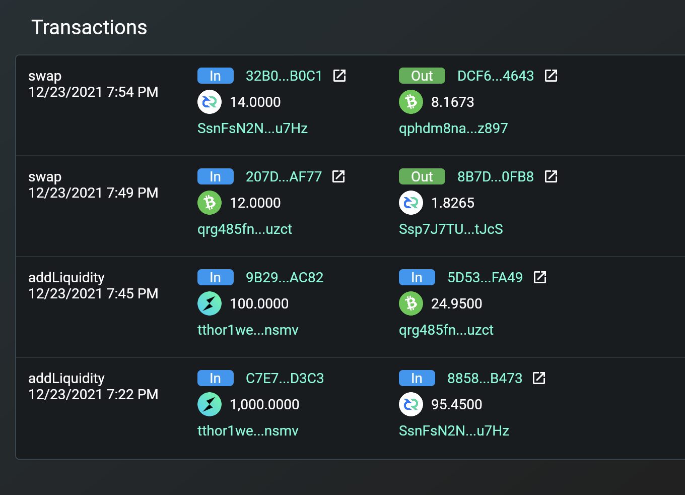

# Thorchain Decred Work Log

**Research**  
[23.11.2021 Tuesday](#23112021-tuesday)  
[24.11.2021 Wednesday](#24112021-wednesday)  
[25.11.2021 Thursday](#25112021-thursday)  

**Work**  
[29.11.2021 Monday 8hrs](#29112021-monday)  
[30.11.2021 Tuesday 7hrs](#30112021-tuesday)  
[01.12.2021 Wednesday 3hrs](#01122021-wednesday)  
[02.11.2021 Thursday 8hrs](#02122021-thursday)  
[03.12.2021 Friday 2hrs](#03122021-friday)  
[08.12.2021 Wednesday 8hrs](#08122021-wednesday)  
[09.12.2021 Thursday 8hrs](#09122021-thursday)  
[21.12.2021 Tuesday 8hrs](#21122021-tuesday)  
[22.12.2021 Wednesday 8hrs](#22122021-wednesday)  
[23.12.2021 Thursday 8hrs](#23122021-thursday)  

[24.01.2022 Monday 4hrs](#24012022-monday)  
[25.01.2022 Tuesday 6hrs](#25012022-tuesday)  
[14.02.2022 Monday 2.5hrs](#14022022-monday)  
[16.02.2022 Wednesday 4hrs](#16022022-wednesday)  
[23.02.2022 Wednesday 7hrs](#23022022-wednesday)  
[01.03.2022 Tuesday 7hrs](#01032022-tuesday)  
[02.03.2022 Wednesday 6hrs](#02032022-wednesday)  
[03.03.2022 Thursday 0hrs](#03032022-thursday)  
[07.03.2022 Monday 4hrs](#07032022-monday)  
[08.03.2022 Tuesday 8hrs](#08032022-tuesday)  

## 23.11.2021 Tuesday

Posted on the TC forum if anyone would be interested in me doing further development / looking into other chains.

Decred guys were interested.  
Said I'd estimate the work that needs to be done...  

The main branch is 125 commits behind the master, quite a lot of work needed there.  
Also seeing merge conflicts.  

https://gitlab.com/-/snippets/2147764  
https://github.com/decred/dcrd  
https://gitlab.com/vikingshield/decred  
https://docs.decred.org/  

Looks like he's aiming at `v1.6.2`.  
Is that the wallet or the protocol?  
The latest wallet version is currently `v1.6.3`  

There is `dcrd-testnet-insight` and `decred-insight-testnet`. A little confusing.  

`CMD ./dcrd -u user -P pass --notls --txindex --listen=127.0.0.1`

• Okay can I run decred in docker easily with vikingshield's image?

```bash
docker run \
  --rm \
  -it \
  registry.gitlab.com/vikingshield/decred
```

> mkdir: can't create directory '': No such file or directory

In contrast to the dash image:

```
docker run \
  --rm \
  -it \
  registry.gitlab.com/alexdcox/dash-core
```

That just runs. (admittedly needs the `-printtoconsole` arg to actually see that it's running but that's the dashd default, so I'm okay with that)

What's happening with the dcred image?

Using this to poke around a bit:
```
docker run \
  --rm \
  -it \
  --entrypoint /bin/bash \
  registry.gitlab.com/vikingshield/decred
```

```
docker run \
  --rm \
  -it \
  --entrypoint dcrd \
  registry.gitlab.com/vikingshield/decred
```

Okay that works fine, must be the entrypoint script.
It's trying to `mkdir $DECRED_DATA`, and that hasn't been given a sensible default.

```
docker run \
  --rm \
  -it \
  -e DECRED_DATA=/root/.dcrd \
  registry.gitlab.com/vikingshield/decred
```

> /scripts/entrypoint.sh: setting data directory to /root/.dcrd
> loadConfig: the specified subsystem [atadir] is invalid -- supported subsystems [ADXR AMGR BCDB BMGR CHAN CMGR DCRD DISC FEES INDX MINR PEER RPCS SCRP SRVR STKE TRSY TXMP]
> Use dcrd -h to show usage

Hmm, well I'm going to skip the entrypoint script and just use the binary for now.
`dcrd` binary running with default config (i.e. no user-defined config)

## 24.11.2021 Wednesday

```bash
docker run \
  --rm \
  --name decred \
  -it \
  --entrypoint dcrd \
  registry.gitlab.com/vikingshield/decred \
    --testnet \
    --rpcuser thorchain \
    --rpcpass thorchain
```

`dcrd version 1.6.2+release (Go version go1.16.4 linux/amd64)`  
So the image is currently one minor version behind.

• What are the default ports for Decred?

|                   | mainnet | testnet | simnet |
| ---               | ---     | ---     | --- |
| `dcrd` p2p        | 9108    | 19108   | 18555 |
| `dcrd` rpc        | 9109    | 19109   | 19556 |
| `dcrdwallet` rpc  | 9110    | 19110   | 19557 |
| `dcrdwallet` grpc | 9111    | 19111   | 19558 |

• Where are the default configuration files?  
/root/.dcrd/dcrd.conf  
/root/.dcrctl/dcrctl.conf  

```
docker exec -it decred dcrctl help
```

## 25.11.2021 Thursday

https://gitlab.com/vikingshield/thornode  
branch: 991-add-decred-chain  
https://gitlab.com/thorchain/thornode/-/merge_requests/1806  
gitlab.com/vikingshield/thornode  

• What does the PR situation look like with outstanding comments?

The tasks seem to be:
- Update to keep one day's block data in the cache
- Remove todos / redundant comments
- Use approproate constants where defined
- Switch string manipluated json with go structs/builtins and marshalJSON
- Node request id is hardcoded in one place
- 1851 PR changes requested
- Context.TODO left in
- 1757 PR changes requested
- Add fee rate estimation checks
- 1953 PR changes requested
- Remove a bitcoin txid check within the decred signer
- Remove version check

Most of these are just trying to maintain coding standards such as:
- Using constants where appropriate
- Correcting find and replace mistakes
- Using objects instead of string manipulation
- Removing redundant code/comments
- Addressing remaining TODOs.

I reckon I could go through every file that has changed from top to bottom and
clean things up within a day.

The big things on the list are the 3 PRs that have already been merged into dev,
that they're asking to be added. Going through those:
- 1851
  Ensure the UTXO to asgard is spendable
  around an hour
- 1757
  Bug: Parallelise mempool scan for BTC/BCH/LTC
  maybe a couple of hours or so
- 1953
  Cherry pick the changes in 0.69.3 back to develop branch
  not sure what they're actually asking from this one
  it doesn't seem to apply to decred

• How easy would a fast-forward merge from develop be?

There are 500 commits that vikingshield needs to catch up on,
everything since the 15th June 2021.

I pulled decred onto the current official develop branch and re-ran git vendor.
Then the tests:

```
go test -tags mocknet ./...
```

Great news, tests are passing.

So the bulk of the work on the actual `gitlab.com/thorchain/thornode` repo involves
tidying up what is already there, and then going through all the changes that have
been applied to the other bifrost clients since June, seeing which changes need to
be applied to Decred, and updating the PR with those changes.

Doing this will include the 3 requests from Heimdal plus any new changes since
he looked at the decred PR.

As a rough estimate I'll look at the diff between the bifrost bitcoin client on
vikingshield's branch compared to the latest official bifrost bitcoin client:

```
gitk --left-right origin/develop...vikingshield/develop -- ./bifrost/pkg/chainclients/bitcoin
```

Okay of those 500 commits only 34 seem to modify the bitcoin bifrost client.
The main things I see skimming through them are:
- log improvements +10m
- switch from error string to error constant/variable +10m
- parallelise mempool scan +2h
- add client method `isValidUTXO` and test `TestIsValidUTXO` +1h
- updates to how txscripts are parsed `txscript.ExtractPkScriptAddrs` +1h
- add locktime and spendable checks +10m
- add `reportSolvency` +20m
- removing spendable checks - in some places? +10m (need to question why now, can I skip, is this a different place, needs further research)
- add `isFromAsgard` check +20m
- gosec fixes, not sure why but doesn't look involved +10m
- remove redundant checks from signer +10m
- HAL-05 +10m
- add `getAddressesFromScriptPubKey` and tests +5h
- replace `getOutput` with `ParseMemo` +10m
- allow mimir to control UTXO (I don't think this applies to Decred from looking at the PR, need to confirm and research) +1h
- move signer cache into chain client +20m
- move signer cache store +10m

So around 12.5hrs of pure coding and we're update to date with the last change
made on the 8th November.

Those are very rough estimates, the easy changes might be even quicker, the more
complicated ones might require more research on my part to understand why the
change was made and how it should be applied to decred.

• What additional work is required to have this PR merged in:

- Updating `https://gitlab.com/thorchain/devops/node-launcher`

This has actually been the most costly part of getting Dash ready in terms of
development time and aws bills.

The code for thornode/bifrost took weeks, getting the node-launcher ready has
taken over 4 months now and I still can't say it's finished because other parts
of that infrastructure aren't working properly so my changes can't be tested yet.

Dash is a little different due to the requirement of multiple masternodes forming
a quorum before chainlocks can be tested.

I found aws to require quite a bit of wrestling. The terraform scripts would often
not teardown my dev environment properly, requiring a bit of manual intervention.
I dare say having worked with it before could bring this to weeks instead of months,
but it's difficult to put a time on this. It's already sprawled far beyond my
expectations with Dash.

I've spoken with Heimdal, he said lets focus on getting `thornode` changes merged
and then turn our attention back to the launcher later.

- Adding smoke tests to `Heimdall`:

Again, I haven't reached this point with dash yet.  
This is an example of the work required:  
https://gitlab.com/thorchain/heimdall/-/merge_requests/145/diffs  

Unsure how long this should take, more than a week or so would suprise me.

## 29.11.2021 Monday

Okay so I've estimated 2 days to get the PR updated and have been given the green
light to work on it. Let's go.

I already have the `991-add-decred-chain` branch from the `vikingshield` origin.  
Merging the develop branch in.

Not sure that commit `668f1fdbc8b21026995f159b2446867edfd2c527` actually needs adding  
The diff doesn't seem as clear as I first hoped, been undoing and redoing some changes  
Perhaps I had the direction round the wrong way:

```
gitk --left-right vikingshield/develop...origin/develop -- ./bifrost/pkg/chainclients/bitcoin
```

That looks better.  
Next step, apply all the changes that the bitcoin client has received that are applicable to decred:

```
git diff --color-words vikingshield/develop...origin/develop -- ./bifrost/pkg/chainclients/bitcoin
```

• Does Decred have RBF? I'm assuming no...  
Suppose I should confirm with the official repo...  
No mention of `^RBF$` or `^replace.by.fee$` so I'm assuming that logic is safe to skip.  
This site also says it "wont" have the RBF feature:  
https://blockgeeks.com/guides/decred/  

Okay I'm ripping out RBF logic for DCR... done.

• Decred doesn't support segwit either, good to know.

Opened up a new PR just to see where I'm at with things:  
https://gitlab.com/thorchain/thornode/-/merge_requests/2012/diffs#b2465110d55fe50c16ef9fc04f0b2d4d68fe7ca4  

Made some silly F&R mistakes myself and updated the bitcoin client, reverting to origin develop...
```
git reset develop --hard -- bifrost/blockscanner/blockscanner.go
git reset develop --hard -- bifrost/pkg/chainclients/bitcoin/client.go
git reset develop --hard -- test/fixtures/btc/sendrawtransaction.json
```
Sorted.

Now onto the todos, of which there are 18 accross 4 files:

--------------------------------------------------------------------------------

`decred.go`
- [x]  504:  check the logic of ExistsMempoolTxs against GetMempoolEntry!

Okay so there's actually no mention of `ExistsMempoolTxs` in any of the other clients.  
Looks like perhaps it's just a method renamed in decred to `GetMempoolEntry`?  
https://docs.decred.org/wallets/cli/dcrctl-rpc-commands/  
Yeah no getmempoolentry according to the docs. This is where I really need a node to compare raw output...  

```
docker run \
  -d \
  -it \
  --name decred \
  -v decred:/root \
  -p 9108:9108 \
  --entrypoint dcrd \
  registry.gitlab.com/vikingshield/decred \
    --rpcuser thorchain \
    --rpcpass thorchain

# watch container logs
docker logs -f decred

# watch block verification progress
watch -n 5 "docker exec decred dcrctl --rpcuser thorchain --rpcpass thorchain getblockchaininfo | jq '.verificationprogress'"

# watch docker volume size
watch -n 5 "docker system df -v | grep decred | tail -n 1"
```

Okay a day later, the node is running. The `existsmempooltxs` command doesn't
return anything other than yes/no, but that's all we need here, so all gravy
and biscuits.

- [x]  710:  check the encoding of tx---is it hexadecimal string of a byte-reversed hash, but any missing characters result in zero padding at the end of the Hash??

Following the source code brings you to a comment above  
`github.com/decred/dcrd/chaincfg/chainhash:Decode` which says:  

> Decode decodes the byte-reversed hexadecimal string encoding of a Hash to a
> destination.

As for the padding, if the hash is not an even length, a null byte is prepended,
before the whole thing is decoded into hex and then reversed.  
Not sure what the confusion regarding the padding is. We're going from a hex
string, which can be compressed - 0 hex char removed - to save a character.  
The result is a 32 byte hash regardless.

I get it. The `ExistsMempoolTxs` func signature needs a chainhash.Hash struct
and the question is how to convert a typical hex txid into that. Donezo.

- [x]  717:  check the logic: result != ""

That's already happening in the next line down. Perhaps this was addressed
without removing the todo, easy fix.

- [x]  740:  this just relies on dcrd command estimatefee. Is this good estimate?

How did I do it for dash?  
`git show 982-add-dash-chain:bifrost/pkg/chainclients/dash/client.go | subl`

Hmm, how do the other clients do it?  
BTC/DASH/LTC/BCH use the `averageFeeRate` from block stats, reported by the node.  
DOGE uses a similar estimatefee command to the proposed decred way.

We're not checking against the min relay fee though, all the others do.

That said the logic to resolve a less than min fee is to increment one satoshi,
which in a lot of cases I'd imagine would still not cut it. I don't follow that.

I think this is fine but will TODO: RAISE THIS WITH HEIMDALL

- [x]  926:  check what we do if get multiple addresses

All the chainclients have this. Must be copypasta. I'm going to leave this as it
ought to be addressed accross all chains at the same time.

- [x]  1080: verbose is ture?

That would surprise me. It is set to verbose, and I'm going to leave it like that
because there are `rawtx` references later on and I'm guessing we need verbose
for that data to be returned in the rpc response (it's often that way for dash)
I'll follow the adage: If it aint broke, don't fix it.

--------------------------------------------------------------------------------

`decred_test.go`
- [x]  194:  To address is the first vout that has value?

If the test passes, I'm happy. If not, I'll find out about it when I get there.
Removed.

- [x]  632:  independently translate this address according to (theres a link)

The start of this test sets the network to `mainnet`, and the link says the
mainnet prefix is `Ds` which is what I'm seeing in the test assertion below.
I don't see why we'd need to transalate this address into any other
network prefix unless we also change the network.
I'll leave the url and remove the todo (perhaps it was already addressed)

--------------------------------------------------------------------------------

`signer.go`
- [x]  38:   copied from BTC. is this good for DCR?

A fantastic question, I have no idea, it's talking about the `defaultMaxDCRFeeRate`.

Can I get this from the node? Wow google is absolutely no help for this query.  
Will have a look at the dcrd codebase quickly... okay found this in `mempool.go`:

```go
  // maxRelayFeeMultiplier is the factor that we disallow fees / kB above the
  // minimum tx fee.  At the current default minimum relay fee of 0.0001
  // DCR/kB, this results in a maximum allowed high fee of 1 DCR/kB.
  maxRelayFeeMultiplier = 1e4
```

Lets try math (see the next todo about estimating tx size for where I get the 250 estimation):
```
maxFeePerKb = 1e8
maxFeePerByte = maxFeePerKb / 1000 = 1e4
estimatedAverageTxSizeInBytes = 250

estimatedAverageTxSizeInBytes * maxFeePerByte = 250 * 1e4 = 2500000 (or DCR 0.025)
```

We're configuring a max fee per transaction, not per byte, so that gives us this
much room:
```
dcrutil.AtomsPerCoin / 10 = 1e8 / 10 = 1e7 (or DCR 0.1)
0.1 / 0.025 = 4
```

So we've picked a maximum fee that I'd guess is around 4 times bigger than the
fee's we should be paying. That seems alright to me.

- [x]  222:  Confirm these calculations remain accurate with Decred.  

This is about `estimateTxSize`  
The btc calc uses a base overhead, then a per-input/output cost, followed by null
data/memo cost 1 satoshi per byte. Apparently it's better to underestimate and 
guess 1 output.  
I suppose it depends on how many fields a raw decred transaction has compared to
bitcoin.  
https://developer.bitcoin.org/reference/transactions.html  
https://devdocs.decred.org/developer-guides/transactions/transaction-format/  
At a glance the inputs seem simplified with decred, there are a few extra
version and format fields in general, but it looks like witness data can be within
a transaction. I'm guessing that's not relevant here.  

Well, there is a golang dcrd fee estimator:  
https://github.com/decred/dcrd/blob/81ae286f2347/internal/fees/estimator.go  
It's not exposed as a public package though, which makes me think RPC is what
they're wanting you to use.  
We could do what Trustwallet does:  
https://github.com/trustwallet/wallet-core/pull/1000/commits/b386d6b0c651e3bd304fde9293976ea47aa53c53

```
mkdir -p ~/code/github.com/trustwallet/wallet-core && cd $_
git clone git@github.com:trustwallet/wallet-core.git .
```

They actually have specific rules for Decred, perfect :)

```cpp
int64_t LinearFeeCalculator::calculate(int64_t inputs, int64_t outputs, int64_t byteFee) const {
    const auto txsize = int64_t(std::ceil(bytesPerInput * (double)inputs + bytesPerOutput * (double)outputs + bytesBase));
    return txsize * byteFee;
}

...

class DecredFeeCalculator : public LinearFeeCalculator {
public:
    DecredFeeCalculator(): LinearFeeCalculator(166, 38, 12) {}
};

...

LinearFeeCalculator(double bytesPerInput, double bytesPerOutput, double bytesBase)
```

```
bytesPerInput  166
bytesPerOutput  38
bytesBase       12

inputs  x
outputs 1

txSize = ceil((bytesPerInput * inputs) + (bytesPerOutput * outputs) + bytesBase + bytesMemo)
txSize = ceil((166 * 1) + (38 * 1) + 12) = 216 + bytesMemo

txFee = txSize * byteFee
```

Okay that'll do nicely.

- [x]  272:  the tree argument: should this be always be 0?

Looking into the source I can see 3 `tree` options: unknown, regular, and stake.
We can rule out the other 2, so... deffo.

- [x]  274:  the valuein argument: should this be always be 0?

This is within `SignTx`
All the other clients set this to `nil`, but the func signature for decred requires
an int for the second argument, so I'm going to go with: yes. I also removed
`[]byte{txscript.OP_0, txscript.OP_0}` in place of `nil`, which I may regret.

- [x]  301:  check: is this true for Decred?

This is the following block of commented text:
> dcrd has a default rule max fee rate should less than 0.1 DCR / kb ??
> the MaxGas coming from THORChain doesn't follow this rule , thus the MaxGas might be over the limit
> as such , signer need to double check, if the MaxGas is over the limit , just pay the limit
> the rest paid to customer to make sure the total doesn't change

We're looking at `decred/signer:SignTx`. I'll try and break this down so I can
better understand what I'm looking at here...

`client.getGasCoin` returns the sats per byte fee for the last transaction
recorded in the thornode local storage for the chain in question.
If the fetched feePerByte multiplied by the estimated tx size to sign is greater
than the max fee, we use the max fee instead.
If the fee estimate is less than the minimum relay fee, we take some funds from
the payout to customer to cover up to the minimum fee.

`SignTx` is only called from `bifrost/signer/sign.go:Signer.signAndBroadcast`
That is called by `Signer.processTransactions`  called by
`Signer.signTransactions` which is looped when `Signer.Start` is called, during
bifrost startup.

The max gas is set on the txout, and where that happens, along with how the gas
is actually observed and set is a bit of a can of worms for my mind right now.
I think many places. Then perhaps thrown into the global transaction queue ready
to be handled by the loop.
h.mgr.GasMgr().AddGasAsset
hander_common_outbound
handler_observed_txout.go
handler_observed_txout_archive.go

Right what am I trying to do again... I think it will work for Decred. All the
other clients are working in the same way. We'll all know if this is wrong when
we smoke test.

- [x]  399:  Check this: Decred does not have virtual size

That's okay, the BCH client doesn't use this either.

- [x]  415:  check: why is the last argument not amount?

I can't admit I understand this either.  
The `redeemTx` argument will already have the utxo values, I don't see the need
for passing in the `amount` again.  
My best guess is the vin signatures for BTC/BCH are constructed using the input
amount, whereas DCR uses the references to the amount instead, so we don't
actually need to say what the amount is, that's checked later by the
node/txscript engine. Regardless of my understanding, the official decred golang
library `txscript.RawTxInSignatureSignable` func doesn't ask for the amount, so
I'm not going to provide it, and assume that they know what they're doing :)

Removing this argument in turn simplifies the `for idx := range redeemTx.TxIn`
loop in `SignTx`. This is another thing I may regret removing in time, looking
forward to testing this...

- [x]  451:  is this flag good enough?

We have `txscript.ScriptDiscourageUpgradableNops` used in `txscript.NewEngine`
within `signUTXO`.

> This flag must not be used for consensus
> critical code nor applied to blocks as this flag is only for stricter
> standard transaction checks.

I don't think it's relevant. Relaced with `nil`.

- [x]  493:  check: btcjson.ErrRPCTxAlreadyInChain == dcrjson.ErrRPCDuplicateTx?

From dcrd:
> TestDuplicateTxError ensures that attempting to add a transaction to the
> pool which is an exact duplicate of another transaction fails with the
> appropriate error.

Good enough for me.

--------------------------------------------------------------------------------

`walletrpc.go`

- [ ] 216:  check: rescan is set to false. Is this correct behavior?

This is related to importing a public key for the node to watch, a command
which decred doesn't actually seem to have.

https://docs.decred.org/wallets/cli/dcrctl-rpc-commands/

Oh vikingshield modified `dcrwallet`, gotcha. I FORGOT ABOUT THIS ONE! TODO: GO BAAACK

`importpubkey`

There's absolutely no mention of this in dcrd. Hold up, what about the wallet?

`go get github.com/decred/dcrwallet`

> go get: github.com/decred/dcrwallet@v1.7.1: parsing go.mod:
>   module declares its path as: decred.org/dcrwallet
>           but was required as: github.com/decred/dcrwallet

Oh :( That's not what you want. They're ignoring the golang module name rules?

```
mkdir -p ~/code/decred/dcrwallet && cd $_
git clone git@github.com:decred/dcrwallet.git .
```

No `importpubkey` found. I did find `importscript` and `importxpub`, also
`CreateWatchingOnlyWallet` but that doesn't look like rpc accessible.
Maybe importscript is the one we need.

Just asked in the decred discord, apparently, create watching only wallet is the
one we need!

Alright lets try and get that working...  
This is the final todo and I'm approaching the end of the day so I'll just
continue the todos.

## 30.11.2021 Tuesday

I'm still continuing with the todo's above from yesterday, just going to leave
them where they are instead of writing in today's log for readability.

• Just want to note that my decred container has caught up and the block size is
10.77GB for mainnet with default config (i.e. no indexes specified)

Okay lets get some info for the `check with node`s above:
```
docker exec -it decred bash
alias dcrctl="dcrctl --rpcuser thorchain --rpcpass thorchain"
```

```
dcrctl getrawmempool
```

```
[
  "f1cc4968774b59d3f1f37713327db474baf362fb40f7e7f9ddcea11a352799da",
  "6282d1f2bd57e083c001199df6e22f2a7915223d35ff4aab25bbdb63637006d0",
  "f4989b85955d0a60ae65408709e6ffd68b563f92bae30f03cedfb7190ea94114",
  "a9f5bf17dd147f4422a2482295100ffb86042582a5686d564153443413e70f51",
  "d6a868618cb5bf1a86c0f843c30273712b453e951995c08aaaa7f050459cd387",
  "f8479c5ac5db60554787a5b787840dd56022f5b75949dee4938e6bb48abcecd5",
  "d9e1d6d3bcc0abbf4fdccf556fecd3e36ec36b91954cd61b175c695c4dea036f",
  "132b8640ca10d8e02d3a2c9dca9bb0a77d04beda54e53689f9656909fa7e9040",
  "01b64926d6a29a8459a52ffa96965ee6fb60feea0a8c9231b72a2fcef49dc78a",
  "dd22aa03345c10054085f4cc008f9f7ee09f259c1cd5f1ac72b2922326db9299",
  "a656030f354346272dcd8070e03a173c4158b9e12c8dcc382a4f129b410249b0",
  "ca32b348ff7fa77fcdbe7d28cf77aa7bc78ba1e8117bf7ecd4a4bf809be281a7",
  "1adc43ba7f4caf132857bf7bcfcaf18f3cfb7c99890f6cb755bd3acd81468d12",
  "c38782a81d09e81c324527022b6524914d4b2480abe872c094fd95cb6eac0b6a",
  "c3062ac0b398102b80b994eed4fdbbb63020a2237f37882f9f95702bdca540f4",
  "7fe58bfd31ee3a43283447959524a086444b0c9f7f01b0b508c8cb027440197c",
  "39dfb8a04791645bdc0dc8f8998e563f8cad76c1322ecc299e5532dec5a7ea01",
  "a90b499c386c3f677fc152825082d34ff4fd0fb6891d6e97afaae1b111fea935",
  "75d23f48ba2c28c0e550a7b492c70667ab0dac34202bde0b2dd8940d4a7ab5a9",
  "16dcdb32b7d003cb39bbe61490cc9ccb7a62ed35b323bb04fc9845f64abf1d3e",
  "8260bcc88fec6a0045f5338f75a12c90a3a616fdafa3eeb522e6def11e6726cc",
  "658170f3bcee2592f38bdd2793d68497a7a8d4c0692bd9b459083b3e707e553d",
  "854aa49e680020414982ce73fc5025730b8bcc26b7e05a1989ffe85bfe572200",
  "b6437be393e61df02c47778d5d00ea9acf954d853299e98288dfdb1eca36414f",
  "d3cd480a9ac41fbef4c1389caa54718d0161d50aa5934b750b322be957af8a67",
  "a4519880dcbbdb3ef53f25d01608108298866b980f5e58311e10332935f04ad0",
  "2ac9d93d1b83c4ea66e1f4ced0176449b9632a5c720f97c17a1b91fab03a45d7",
  "84a9e958e0fbe72b10ccde640b4a4da22aaf6fac69b816dd6437a90d6269cfa3",
  "3150c611b68f53c1f21ffd9d3c656f23475697dd9a869b8746ef029fd6bb2c0b",
  "851d4524e74580f87fc8904827fb4b8e1903840ff857aae3c714d0a1012ca7ad",
  "c1c4a6b95fd7efa66bf374bae423c70826eee9cf86fca34f2802f329db6c9373",
  "2840caad84a22c965a9ffaec0fc5592c942c9bed2c1a60f4ddb0302da0279e27",
  "86fac87e4b030503ae05122bb3586dbca6345122125e16ab9bf412e85d273924",
  "8613fde5cb04e2572d7dbc85492838e3bb5d381adb200f33ebd6e56f173a7010",
  "16d6dd2ce0ba98da98b47f7f319323f116f6a5acd197a97194e932971355103d",
  "a867d6b82cbbdea8e1c19c7373b5d0a7019e279a56c7f9f18b6bb49371e8f677",
  "1ae15ec61528964e7be858e18ea7a033208052f074ee739b4dbe42e2341e9aa1",
  "2b7bff50af83fec9f4fa8bfc94cb9b537dd4f1748582b4fa8647c6e4b0e90227",
  "f14837f2ce2b984ac96066a468db5b4525b24b0c535f7efacb8ab59530f755cd",
  "d57341964f43753adf09e51b79122ee74b788fee03795cd660db8509b2985fe8",
  "b6a22ea303629d70082ac93e0a05388303bc817e96381d6cc7f593ca921fd3f0",
  "a287c74feb48cbbf27226f4b982a617fcd78616f5955b30608e19c14966825b3",
  "2145cbfda3a341da7cf9451ff7e99ea245f41ddfab9291e9a4fe56ec70193ab0"
]
```

```
dcrctl existsmempooltxs 16dcdb32b7d003cb39bbe61490cc9ccb7a62ed35b323bb04fc9845f64abf1d3e
dcrctl existsmempooltxs '[\"16dcdb32b7d003cb39bbe61490cc9ccb7a62ed35b323bb04fc9845f64abf1d3e\"]'
dcrctl existsmempooltxs \[\"16dcdb32b7d003cb39bbe61490cc9ccb7a62ed35b323bb04fc9845f64abf1d3e\"\]
```

Third time lucky, it returned:
```
01
```

And for a missing txid:
```
dcrctl existsmempooltxs \[\"111cdb32b7d003cb39bbe61490cc9ccb7a62ed35b323bb04fc9845f64abf1d3e\"\]
```

```
00
```

Strange there are two digits returned there.

```
dcrctl getmempoolentry \[\"16dcdb32b7d003cb39bbe61490cc9ccb7a62ed35b323bb04fc9845f64abf1d3e\"\]
```

> Unrecognized command "getmempoolentry"

Well, of course, silly me.

```
dcrctl getrawmempool true
```

```
{
  "47f03fbda26773cae25dea43260a86123bf4e478d4bd053822f302a8aceec2fd": {
    "size": 296,
    "fee": 0.0000298,
    "time": 1638317301,
    "height": 611873,
    "startingpriority": 0,
    "currentpriority": 160020187.6818182,
    "depends": []
  },
  "51661732f202987c6bc14d236086936ab6d08d8550766e0cba48f64e528a17df": {
    "size": 296,
    "fee": 0.0000298,
    "time": 1638317301,
    "height": 611873,
    "startingpriority": 0,
    "currentpriority": 160020187.6818182,
    "depends": []
  },
  "55bbc884166062b74b192bc29861fe4bad8e19ffff34ffa2051a794273c740c3": {
    "size": 297,
    "fee": 0.0000298,
    "time": 1638317301,
    "height": 611873,
    "startingpriority": 0,
    "currentpriority": 160020187.6818182,
    "depends": []
  },
  ...
}
```

```
dcrctl getrawtransaction 16dcdb32b7d003cb39bbe61490cc9ccb7a62ed35b323bb04fc9845f64abf1d3e
```

> -32603: The transaction index must be enabled to query the blockchain (specify --txindex)

Hmm. Lets check `thornode/test/fixtures/btc/...` oh - it's not there.
Was expecting a `getmempoolentry.json` fixture.

```
dash-cli getrawmempool
dash-cli getmempoolentry \[\"ce83854ad6461c56f06c092199fdc64c1480654e3478f52aee49e1fc4945a965\"\]
dash-cli getmempoolentry ce83854ad6461c56f06c092199fdc64c1480654e3478f52aee49e1fc4945a965
```

```
{
  "fees": {
    "base": 0.00000226,
    "modified": 0.00000226,
    "ancestor": 0.00000226,
    "descendant": 0.00000226
  },
  "size": 225,
  "fee": 0.00000226,
  "modifiedfee": 0.00000226,
  "time": 1638317598,
  "height": 1580628,
  "descendantcount": 1,
  "descendantsize": 225,
  "descendantfees": 226,
  "ancestorcount": 1,
  "ancestorsize": 225,
  "ancestorfees": 226,
  "depends": [
  ],
  "spentby": [
  ],
  "instantlock": true
}
```

At first glance it looks like the decred getrawmempool with verbose output will
do the trick.

• Decred DOES have the concept of `witness` to a transaction, but it is stored
within transactions on the block instead of segregated as is the case with
bitcoin. I'm assuming this is thanks to a greater block size limit.

Alright there's only one todo that I haven't been able to fully address at the
moment and that is because it requires a bit more research.

There's `dcrd`, the node software, and a separate `dcrwallet` deamon/program for
wallet functionality. Intersting design choice, most chains implement wallet code
along with the core platform code.

They both have separate rpc interfaces. Quite different ones on first glance.
I assume the node I've spun up doesn't even have the `dcrwallet` binary running.
Unless running `dcrd` also has the logic for forking a child process for
`dcrwallet`.

This leads me with quite a few questions. I'm now thinking launching the docker
container with `--entrypoint dcred` is not enough for testing with thorchain as
we also need the wallet binary running.
- Does the `dcrwallet` binary exist in the container?
- Does the entrypoint script start both the wallet and the node?
- What port does the wallet run on? (so I can expose that port)

Alright time to work through those...

```
which dcrwallet
```

> /usr/local/bin/dcrwallet


Okay, that's good. The wallet binary is built into the container.

```
grep -ir "dcrwallet" /scripts/entrypoint-mock.sh
```

> dcrwallet --nogrpc --noservertls  --simnet --username=${SIGNER_NAME} --password=${SIGNER_PASSWD} --pass=${SIGNER_PASSWD} --rpclisten=$(grep $(hostname) /etc/hosts | cut -f 1) --rpclisten=127.0.0.1

Yep. Fair enough. The entrypoint script already starts the wallet.

Alright now to get the container running via the default entrypoint script
because running it without any arguments fails.

First things first: can I actually configure the current image to work at all?

So to refresh our memory: running it without any environment variables resulted
in the error:

> mkdir: can't create directory '': No such file or directory

Running with the `DECRED_DATA` env. variable configured - the only variable
referenced in the default `/scripts/entrypoint.sh` script - results in:

```
docker run \
  --rm \
  -it \
  -e DECRED_DATA=/root/.dcrd \
  registry.gitlab.com/vikingshield/decred
```

> loadConfig: the specified subsystem [atadir

The problem is this line:
```
  set -- "$@" -datadir="$DECRED_DATA"
```

`datadir` requires a double dash `--` as it's a multiple character argument.
Easy mistake, but it does mean I need to rebuil the image with a valid script
built in at some point.

For now I'll just override that script with one from my dev machine.

```
docker run \
  --rm \
  -it \
  -e DECRED_DATA=/root/.dcrd \
  -v decred:/root \
  -v /Users/adc/Desktop/thorchain-decred/entrypoint.sh:/scripts/entrypoint.sh \
  registry.gitlab.com/vikingshield/decred
```

Getting this:

> 2021-12-01 05:19:16.653 [ERR] DCRD: stat /root/.dcrd/mainnet/blocks_ffldb/metadata: permission denied: stat /root/.dcrd/mainnet/blocks_ffldb/metadata: permission denied


## 01.12.2021 Wednesday

Okay I need this node working with the modified wallet binary running and accessible.

```
# testnet entry

docker run \
  -it \
  -p 19108-19111:19108-19111 \
  -e DECRED_DATA=/root/.dcrd \
  -v decred:/root \
  -v /Users/adc/Desktop/thorchain-decred/entrypoint-testnet.sh:/scripts/entrypoint-testnet.sh \
  --rm \
  --name decred \
  --entrypoint /scripts/entrypoint-testnet.sh \
    registry.gitlab.com/vikingshield/decred

# no volume, bash entry

docker run \
  -it \
  -p 19108-19111:19108-19111 \
  -e DECRED_DATA=/root/.dcrd \
  -v /Users/adc/Desktop/thorchain-decred/entrypoint-testnet.sh:/scripts/entrypoint-testnet.sh \
  --rm \
  --name decred \
  --entrypoint bash \
    registry.gitlab.com/vikingshield/decred
```

```
grep -ir "testnet" /scripts/
```

No entrypoint script for testnet. We'll need that for... testing.
Also seeing the `--nogrpc` argument supplied to `dcrwallet`, so I'll have to
remove that if I want to use `CreateWatchingOnlyWallet`.

Getting this error:

> loadConfig: mining address 'SsXciQNTo3HuV5tX3yy4hXndRWgLMRVC7Ah' failed to decode: unknown address type

Probably was a missing testnet flag.

```
curl \
-i \
-u thorchain:password \
-X POST \
-H "Content-Type: application/json" \
--data  '{"jsonrpc":"1.0", "method":"createwatchingonlywallet"}' \
localhost:19110 
```

> {"jsonrpc":"1.0","result":null,"error":{"code":-32601,"message":"Method not found"},"id":null}


```
curl \
-i \
-u thorchain:password \
-X POST \
-H "Content-Type: application/json" \
--data  '{"jsonrpc":"1.0", "method":"walletrpc.WalletLoaderService/CreateWatchingOnlyWallet"}' \
localhost:19110 
```


> Unrecognized command "importpubkey"


Looks like he may have only added the `importpubkey` command to the legacy
jsonrpc interface.

```
curl \
-i \
-u thorchain:password \
-X POST \
-H "Content-Type: application/json" \
--data  '{"jsonrpc":"1.0", "id": 1, "method":"importpubkey", "params": ["test1"]}' \
localhost:19110 
```

```
dcrctl \
  --rpcuser=thorchain \
  --rpcpass=password \
  importpubkey
```

```
alias dcrctl="dcrctl --testnet --rpcuser=thorchain --rpcpass=password --notls --wallet"
dcrctl createnewaccount alex
dcrctl getmasterpubkey alex
```

```
curl \
  -i \
  -u thorchain:password \
  -X POST \
  -H "Content-Type: application/json" \
  --data  '{"jsonrpc":"1.0", "id": 1, "method":"importpubkey", "params": ["tpubVogJaho4zn3z5xZTqe8FZitorpFhb4Dp8JAVtmBZuw26QaQEf2yUj6n3vA8hDKNES8ZJYhwbgfSBDZAiymo6EpfvdbFimLQf7vJ8ywid9K6"]}' \
  localhost:19110
```

> {"jsonrpc":"1.0","result":null,"error":null,"id":1}

No error, no result. Interesting. Perhaps it needs the pubkey in a different
format?

Was distracted by other tasks, half day today.


## 02.12.2021 Thursday

So, the `importpubkey` response was a bit confusing. Let's try with a simple
hex pubkey.

Here's a random new ecdsa keypair:
```
private:               d2b15503374495a660249e203fdbb3a0196fc214b9d22fa1ff1f869a989e9c86
public (uncompressed): 048e75c235571830610035a69c0b5122cc03dac1323f98ff9f5eb11347844431d4b8ff4fa094209d7cea32548149b7879b5e7c9e9501e47d7817fd11a64ea3d10f
public (compressed):   038e75c235571830610035a69c0b5122cc03dac1323f98ff9f5eb11347844431d4
```

Does it take the pub hex compressed?

```
curl \
  -i \
  -u thorchain:password \
  -X POST \
  -H "Content-Type: application/json" \
  --data  '{"jsonrpc":"1.0", "id": 1, "method":"importpubkey", "params": ["038e75c235571830610035a69c0b5122cc03dac1323f98ff9f5eb11347844431d4"]}' \
  localhost:19110
```

> {"jsonrpc":"1.0","result":null,"error":{"code":-32600,"message":"Invalid request"},"id":null}

Okay so perhaps it does need the tpub/pub format. 

I have a feeling that isn't going to be enough, we need the following methods:
- importpubkey
- listunspent
- getnetworkinfo

```
curl \
  -i \
  -u thorchain:password \
  -X POST \
  -H "Content-Type: application/json" \
  --data  '{"jsonrpc":"1.0", "id": 1, "method":"getnetworkinfo", "params": []}' \
  localhost:19110
```

`getnetworkinfo` works fine.


```
alias dcrctl="dcrctl --testnet --rpcuser=thorchain --rpcpass=password --notls --wallet"
dcrctl createnewaccount alex
dcrctl getmasterpubkey alex

```

`dcrctl listaccounts`
```
{
  "alex": 0,
  "default": 0,
  "imported": 0
}
```

Probably important to note `imported` becomes a separate `account`.

```
dcrctl getnewaddress alex
```

```
curl \
  -i \
  -u thorchain:password \
  -X POST \
  -H "Content-Type: application/json" \
  --data  '{"jsonrpc":"1.0", "id": 1, "method":"listunspent", "params": [0, 99999, ["TskLJuhkrBSqxbL2pa9oCnwTP7RzB7mkNsz"], "imported"]}' \
  localhost:19110
```

> {"jsonrpc":"1.0","result":null,"error":null,"id":1

Looks okay. I'm going to leave the grpc stuff here for a mo

```
  // "localhost:19111"

  conn, err := grpc.Dial(c.walletcfg.WalletRPCServer)
  if err != nil {
    fmt.Println(err)
    return
  }
  defer conn.Close()

  walletClient := pb.NewWalletLoaderServiceClient(conn)
  _, err = walletClient.CreateWatchingOnlyWallet(
    c.defaultRPCContext(),
    &pb.CreateWatchingOnlyWalletRequest{
      ExtendedPubKey:   pubkeyHex,
      PublicPassphrase: nil,
    },
  )
  if err != nil {
    return err
  }
```

Okay on with seeing how things went...

```
go test -tags mocknet ./...
```

TestEstimateTxSize broke, understandably, because I updated the logic there.

Beaut, all now passing. Going to double check I've addressed all the PR comments
from Heimdall.

Just found this in `TestRPCClient`:
> This test needs Decred mockent dcrd/dcrwallet running at standard ports

We should be mocking http responses from dcrd/dcrwallet so the tests can run
without dependencies. I'm wary. Re-running the tests without a local decred node
accessible... all is well. Glossing over...

Sent Heimdall a message about: `EstimateAverageTxSize*uint64(feeRate) < c.minRelayFeeSats`

I removed walletrpc_test because it wasn't actually testing anything that is used
by the decred module.

Okay testing with my stack now...


```
# no volume, bash entry

docker run \
  -it \
  -p 19108-19111:19108-19111 \
  -e DECRED_DATA=/root/.dcrd \
  --rm \
  --name decred \
  --entrypoint bash \
    registry.gitlab.com/vikingshield/decred
```

I'm going to re-save the vikingshield image with `socat` and `jq` installed,
for use with my scripts:

```
docker run --name decred --rm -it --entrypoint bash registry.gitlab.com/vikingshield/decred

apk add socat jq

docker commit decred registry.gitlab.com/vikingshield/decred
```

`dcrdctl --rpcserver=$1 getblockchaininfo 2>/dev/null | jq -r '.verificationprogress' 2>/dev/null`

So I've noticed that the `notls` option cannot be used when allowing connections
from any ip other than localhost. Other nodes don't enforce this. I don't really
want to be using TLS with all the additional configuration and complications that
goes with it for https, I'd rather handle this via network security (or not at
all for development)

I COULD just tell it to listen on a different port and forward all external
traffic to that port through `socat`, so it looks like local traffic, thereby
circumnavigating the tls requirement.

Is this wise? I'm not preventing it from being configured in the official
thornode repo, so I think it is wise for this dev cluster. Keep it simple.

19556 -> 20556

```
socat TCP-LISTEN:19556,fork TCP:localhost:20556 &
```

```
while true; do clear; docker logs -f decred1; sleep 1; done
while true; do clear; docker exec -it decred1 bash; sleep 1; done

while true; do clear; docker logs -f decred2; sleep 1; done
while true; do clear; docker exec -it decred2 bash; sleep 1; done

while true; do clear; docker logs -f thornode1; sleep 1; done
while true; do clear; docker logs -f thornode2; sleep 1; done

while true; do clear; docker logs -f bifrost1; sleep 1; done
while true; do clear; docker exec -it bifrost1 bash; sleep 1; done

while true; do clear; docker logs -f bitcoincash1; sleep 1; done

cat /root/.dcrd/dcrd.log
```

Had to write the .dcrctl config file too.
Now I have a cluster, 2 thornodes, 2 bifrost, 2 decred, 2 bifrost.

Actually that's a lie.
> standard_init_linux.go:228: exec user process caused: no such file or directory

thornode and bifrost are reporting that error. Maybe needs an image rebuild?

```
docker run \
  -it \
  --rm \
  --name thornode1 \
  --entrypoint /bin/bash \
  github.com/alexdcox/thornode:mocknet

thornode start --log_level debug --log_format json --rpc.laddr tcp://0.0.0.0:26657

```

Oh I probably built my docker container with bash, socat and jq installed...

```
docker run -it --rm --name thornode1 --entrypoint sh github.com/alexdcox/thornode:mocknet
apk add bash socat jq
docker commit thornode1 github.com/alexdcox/thornode:mocknet
```

For some reason `DASH` is still showing up in the inbound addressses list, despite
me not configuring that with the bifrost.

`cat /etc/bifrost/config.json`

Okay here are some errors from the bifrost logs:

> {
>     "level": "fatal",
>     "service": "bifrost",
>     "module": "bifrost",
>     "error": "fail to create block scanner: Post \"http://decred1:19557\": dial tcp 172.32.62.1:19557: connect: connection refused",
>     "chain_id": "DCR",
>     "time": "2021-12-03T05:51:53Z",
>     "message": "fail to load chain"
> }

> {
>     "level": "fatal",
>     "service": "bifrost",
>     "module": "bifrost",
>     "error": "fail to create block scanner: Post \"http://decred1:19557\": EOF",
>     "chain_id": "DCR",
>     "time": "2021-12-03T06:10:11Z",
>     "message": "fail to load chain"
> }

• The chainclients actually match the `BlockScannerFetcher` interface. Important
realisation there. The importance of that is the three main methods:
- FetchMemPool
- FetchTxs
- GetHeight

One of these is causing the EOF error above, and I'm assuming it's get height.

```
curl \
  -i \
  -u thorchain:password \
  -X POST \
  -H "Content-Type: application/json" \
  --data  '{"jsonrpc":"1.0", "id": 1, "method":"getblockcount"}' \
  localhost:19556

curl \
  -i \
  -u thorchain:password \
  -X POST \
  -H "Content-Type: application/json" \
  --data  '{"jsonrpc":"1.0", "id": 1, "method":"getblockcount"}' \
  localhost:19557

curl \
  -i \
  -u thorchain:password \
  -X POST \
  -H "Content-Type: application/json" \
  --data  '{"jsonrpc":"1.0", "id": 1, "method":"importpubkey"}' \
  localhost:19556
```

The above curl requests demonstrate the issue here. For `decred` we need to configure
both the node rpc and the wallet rpc. Thornode/bifrost isn't designed for having two
rpc endpoints. I'm not entirely sure the best way to continue.

The `BlockScannerConfiguration` struct only has one field for the rpc host:
```go
type BlockScannerConfiguration struct {
  RPCHost                    string        `json:"rpc_host" mapstructure:"rpc_host"`
  StartBlockHeight           int64         `json:"start_block_height" mapstructure:"start_block_height"`
  BlockScanProcessors        int           `json:"block_scan_processors" mapstructure:"block_scan_processors"`
  HttpRequestTimeout         time.Duration `json:"http_request_timeout" mapstructure:"http_request_timeout"`
  HttpRequestReadTimeout     time.Duration `json:"http_request_read_timeout" mapstructure:"http_request_read_timeout"`
  HttpRequestWriteTimeout    time.Duration `json:"http_request_write_timeout" mapstructure:"http_request_write_timeout"`
  MaxHttpRequestRetry        int           `json:"max_http_request_retry" mapstructure:"max_http_request_retry"`
  BlockHeightDiscoverBackoff time.Duration `json:"block_height_discover_back_off" mapstructure:"block_height_discover_back_off"`
  BlockRetryInterval         time.Duration `json:"block_retry_interval" mapstructure:"block_retry_interval"`
  EnforceBlockHeight         bool          `json:"enforce_block_height" mapstructure:"enforce_block_height"`
  DBPath                     string        `json:"db_path" mapstructure:"db_path"`
  ChainID                    common.Chain  `json:"chain_id" mapstructure:"chain_id"`
}
```

This is a generic config struct used for all block scanners across all chains, so
it doesn't feel right adding another field just for decred.

Other options...?

Okay well vikingshield has already created the `WalletConfig` struct with 
an `RPCServer` field. Is there logic to read this config value from somewhere?

Hmm, he actually sets that field from the block scanner config, using the same
`cfg.RPCHost` value for both:
```go
  walletcfg := WalletConfig{
    RPCUser:         cfg.UserName,
    RPCPassword:     cfg.Password,
    RPCServer:       cfg.RPCHost,
    WalletRPCServer: cfg.RPCHost,
    Wallet:          true,
    AuthType:        authTypeBasic,
    NoTLS:           cfg.DisableTLS,
    PrintJSON:       false,
    TLSSkipVerify:   true,
  }
```

There's also a generic `ChainConfiguration` struct with `RPCHost`. Anything chain
specific anywhere?

Maybe that's the answer. Set the block scanner and chain rpc host differently.
Although chain rpc to me says block info, so does block scanner. I'd rather not
confuse other developers if I can help it...

vikingshield set `localhost:19557` as the `ChainConfiguration.RPCHost`, which is
the wallet rpc endpoint.

Hmmmmm.

1. Create a facade/proxy which redirects requests according to the rpc `method`
2. Configure chainconfig.rpchost and blockscanner.rpchost differently, document
   the decred necessesity, be careful to use the right one in the right place
3. Hard-code a wallet rpc port, or derive it from the node rpc port
   (i.e. tell people the wallet RPC HAS to be one port higher than the node port,
   which is the default)
4. Modify thorchain to allow for additional chain-specific config

</br>

1. Is time consuming and another codebase to maintain
2. Isn't super clear, might confuse devs, probably breaks other devops flows which
  are coded with the assumption that they're the same value, as is the case with
  all the other chain clients
3. Involves a new convention, which needs to be clearly communicated and followed
  with the risk of breaking things otherwise
4. Is the approach I'd take if I was the maintainer, but I'm not, and it
   introduces changes outside of the decred bifrost client which would require
   more intense review when it comes to PR this

I'm thinking something like this on the `ChainConfiguration`:
```go
Extra interface{} `json:"extra" mapstructure:"extra"`
```

If I'm guessing correctly, adding just that single line would be enough. Setting
`extra` in the bifrost config like:
```json
{
  "chain_id": "DCR",
  "rpc_host": "decred1:19556",
  "username": "thorchain",
  "password": "password",
  "http_post_mode": 1,
  "disable_tls": 1,
  "block_scanner": {
    "rpc_host": "decred1:19556",
    "enforce_block_height": false,
    "block_scan_processors": 1,
    "block_height_discover_back_off": "5s",
    "block_retry_interval": "10s",
    "chain_id": "DCR",
    "http_request_timeout": "30s",
    "http_request_read_timeout": "30s",
    "http_request_write_timeout": "30s",
    "max_http_request_retry": 10,
    "start_block_height": "0",
    "db_path": "/var/data/bifrost/observer/"
  },
  "extra": {
    "wallet_rpc_host": "decred1:19557"
  }
}
```
Would be automatically picked up when the main bifrost configuration object is
loaded. Have 30mins on the clock left for today, lets see how viable (4) actually is...

Yep. That worked. I'll send the options to heimdall and see what he thinks.

## 03.12.2021 Friday

No response from Heimdall unfortunately. I'll continue on as though he's happy
with this resolution for now and see if I can get a pool activated and swaps
being handled.

Actually I'll ask the Decred sponsor for the "go ahead" first...

Had a little mess around with this snippet to see what it does with actual
figures and it clicked, it's all in satoshis, including the fee rate, and
the ++ increment is a rounding fix (if rounded below min) quite obvious now I
look at it.

```js
if EstimateAverageTxSize*uint64(feeRate) < c.minRelayFeeSats {
  feeRate = int64(c.minRelayFeeSats) / EstimateAverageTxSize
  if uint64(feeRate)*EstimateAverageTxSize < c.minRelayFeeSats {
    feeRate++
  }
}

```

```js
function testing(EstimateAverageTxSize, feeRate, minRelayFeeSats) {
  console.log({
    EstimateAverageTxSize,
    feeRate,
    minRelayFeeSats,
  })
  if (EstimateAverageTxSize * feeRate < minRelayFeeSats) {
    console.log('fee rate is less than the min relay fee, recalculate using min relay fee and average tx size')
    feeRate = minRelayFeeSats / EstimateAverageTxSize
    if (feeRate * EstimateAverageTxSize < minRelayFeeSats) {
      console.log('fee rate is', feeRate, 'increment by one satoshi')
      feeRate++
    }
  } else {
    console.log('do nothing')
  }
  console.log('fee rate', feeRate, 'or', feeRate / 1e8)
}

testing(400, 0.0025 * 1e8, 0.0001 * 1e8) // do nothing
testing(400, 0.0001 * 1e8, 0.0001 * 1e8) // do nothing
testing(400, 0.0000001 * 1e8, 0.0001 * 1e8) // set to min
```

Spoke with Decred sponsor for first payment / billing round.  
They mentioned this PR for FE work:  
https://github.com/xchainjs/xchainjs-lib/pull/410  
Also said they'd be happy to learn how to setup my cluster for demos if need be.  

## 08.12.2021 Wednesday

Goals for today:
- [ ] demonstrate providing liquidity to the decred pool
- [ ] execute a swap from BCH to DCR
- [ ] execute a swap from DCR to BCH

Still getting the bifrost error:

```json
{
    "level": "fatal",
    "service": "bifrost",
    "module": "bifrost",
    "error": "fail to register (tthorpub1addwnpepqvcndn85kpt9aqmw42uqq58hdfkr0xac2qydsqfvsszzydg7086cwj988pt): -32601: Method not found",
    "chain_id": "DCR",
    "time": "2021-12-08T23:44:56Z",
    "message": "fail to load chain"
}
```

I had wallet / rpc round the wrong way. Now getting:

> Post \"http://localhost:19557\": EOF

Invalid rpc response? What's happening there? What about grpc?

> grpc: no transport security set (use grpc.WithInsecure() explicitly or set credentials)

Have I configured rpc creds?  
Nope, in actual fact I'm not even running dcrwallet, hence the EOF.  

```
curl \
  -i \
  -u thorchain:password \
  -X POST \
  -H "Content-Type: application/json" \
  --data  '{"jsonrpc":"1.0", "id": 1, "method":"importpubkey"}' \
  localhost:19557
```

```
curl \
  -i \
  -u thorchain:password \
  -X POST \
  -H "Content-Type: application/json" \
  --data  '{"jsonrpc":"1.0", "id": 1, "method":"importpubkey", "params": ["tpubVogJaho4zn3z5xZTqe8FZitorpFhb4Dp8JAVtmBZuw26QaQEf2yUj6n3vA8hDKNES8ZJYhwbgfSBDZAiymo6EpfvdbFimLQf7vJ8ywid9K6"]}' \
  localhost:19557
```

> -9: disconnected from network

> Wallet synchronization stopped: rpcsyncer.Run: tls: first record does not look like a TLS handshake

Could this be the `dcrwallet` complaining that `dcrd` is not using tls?  
Config time...

Flags of note:
- noinitialload
- rpcconnect
- noclienttls  <-- There it is
- dcrdusername
- dcrdpassword

> {"jsonrpc":"1.0","result":null,"error":null,"id":1}

That's better, kinda. Does it all work now?  
Next error:  

> ERR fail to get network info error="cannot unmarshal result: json: Unmarshal(nil *types.GetNetworkInfoResult)" module=decred service=bifrost

Simple reference error, resolved.

`curl -s localhost:1317/thorchain/inbound_addresses`

DCR not on list. Needed to add to thornode config.  
Now it is address resolves to: `Ssktgzi4bMDn425TKGoYBkeMuV1Nc9p6eZN`  
Network explorer up and running against my testnet.  

```
dcrctl --wallet getbalance default
dcrctl --wallet getnewaddress
```

> account=0 branch=0 child=1
> SsWKp7wtdTZYabYFYSc9cnxhwFEjA5g4pFc

The mining address was not set to the first child address generated by the
wallet with the hardcoded seed? Where did the previous address come from??  
...guessing it was just set from a fresh keypair. Created a new one.


#### Create and Fund Thorchain Wallet
```bash
printf "hat pony twist patient select coffee rhythm erosion soul occur speed athlete carry top present curious slide left enjoy mirror kit dinner switch scout\npassword\n" | thornode keys add alex \
  --keyring-backend=file \
  --recover

echo "password" | thornode tx thorchain send tthor1wep80ynx5m4n26h4uvj9yrlvlc0q6jjcsvnsmv 1200000000000rune \
  --from thorchain \
  --keyring-backend=file \
  --chain-id thorchain \
  --yes

thornode query bank balances tthor1wep80ynx5m4n26h4uvj9yrlvlc0q6jjcsvnsmv
```

#### Creating the Decred Pool

`Ssktgzi4bMDn425TKGoYBkeMuV1Nc9p6eZN` is the DCR inbound address.

There were issues...

```bash
# thornode1
# ---------

echo "password" | thornode tx thorchain deposit 100000000000 RUNE "add:dcr.dcr:SSh65TU6a2SaZEVkS3nmEayskmM5axzK315" \
  --from alex \
  --keyring-backend=file \
  --chain-id thorchain \
  --yes

# decred1
# -------

dcrctl --wallet sendfrom default SSh65TU6a2SaZEVkS3nmEayskmM5axzK315 100.0 1 "add:DCR.DCR:tthor1wep80ynx5m4n26h4uvj9yrlvlc0q6jjcsvnsmv"


printf 'add:dcr.dcr:tthor1wep80ynx5m4n26h4uvj9yrlvlc0q6jjcsvnsmv' | hexdump -v -e '/1 "%02x"'
# 6164643a6463722e6463723a7474686f72317765703830796e78356d346e3236683475766a3979726c766c633071366a6a6373766e736d76bash-5.0

dcrctl --wallet listunspent
dcrctl --wallet createrawtransaction \
  '[{"txid": "cd9356a60480ed0c2717efe35ed8ec5eb15d7cc624c65b7af38b11cdeab10559", "vout": 0}]' \
  '{"SSh65TU6a2SaZEVkS3nmEayskmM5axzK315": 299.95, "Ssp7J7TUmi5iPhoQnWYNGQbeGhu6V3otJcS": 0.045, "data": "6164643a6463722e6463723a7474686f72317765703830796e78356d346e3236683475766a3979726c766c633071366a6a6373766e736d76"}'
```

#### Creating the Bitcoin Cash Pool

`qqg2t4amlm90ahzhr5ywexfeh6kmguqp3y82lhg5fm` is the BCH inbound address.

```
# bitcoincash1
# ---------

hexData="$(printf 'add:bch.bch:tthor1wep80ynx5m4n26h4uvj9yrlvlc0q6jjcsvnsmv' | hexdump -v -e '/1 "%02x"')"
addr=$(bitcoin-cli -rpcuser=thorchain -rpcpassword=password -regtest getnewaddress)
bitcoin-cli -rpcuser=thorchain -rpcpassword=password -regtest generatetoaddress 100 $addr
bitcoin-cli listunspent

bitcoin-cli createrawtransaction \
  '[{"txid": "042c810c8a9589cdc8c37296ab20da26c356171c14262f81fa624d088c175b8e", "vout": 0}]' \
  '{"qqg2t4amlm90ahzhr5ywexfeh6kmguqp3y82lhg5fm": 24.95, "qq00ngycmant2jg40l7auwy45hsaj0yelcnr0q7uck": 0.0003, "data": "6164643a6263682e6263683a7474686f72317765703830796e78356d346e3236683475766a3979726c766c633071366a6a6373766e736d76"}'

bitcoin-cli signrawtransactionwithwallet 02000000018e5b178c084d62fa812f26141c1756c326da20ab9672c3c8cd89958a0c812c040000000000ffffffff03c0adb694000000001976a91410a5d7bbfecafedc571d08ec9939beadb470018988ac30750000000000001976a9141ef9a098df66b549157ffdde3895a5e1d93c99fe88ac00000000000000003a6a386164643a6263682e6263683a7474686f72317765703830796e78356d346e3236683475766a3979726c766c633071366a6a6373766e736d7600000000

bitcoin-cli sendrawtransaction 02000000018e5b178c084d62fa812f26141c1756c326da20ab9672c3c8cd89958a0c812c04000000006a47304402202d7dcc35eaf47531920989544f6ac5a6986b36370e470ab3a239dabb64fa8fc102201b27dd16a66514a25be243698eb45be22167fea83b5a086c93e7ea79646edeab412103243417ec82f6bc1026191b5012b987d90e57b627dda190794cebd8d2da9980e9ffffffff03c0adb694000000001976a91410a5d7bbfecafedc571d08ec9939beadb470018988ac30750000000000001976a9141ef9a098df66b549157ffdde3895a5e1d93c99fe88ac00000000000000003a6a386164643a6263682e6263683a7474686f72317765703830796e78356d346e3236683475766a3979726c766c633071366a6a6373766e736d7600000000

# 5d537046b4423c4cde3ae86880d5f93df21fca7fb24be38675be14132df5fa49


# thornode1
# ---------

echo "password" | thornode tx thorchain deposit 10000000000 RUNE "add:bch.bch:qrg485fnuvfpjzr7qkg4wq2lvu29cftjcgj2n9uzct" \
  --from alex \
  --keyring-backend=file \
  --chain-id thorchain \
  --yes

```

Sometimes my DCR add liquidity transactions aren't being accepted by thorchain.
Why?

This step usually works, now it has stopped working. I wonder if it has something
to do with the order of the inputs created from the `sendfrom` command. I'm 
guessing the destination address is not the first txout, but the change address
is in this case. If presented that way in the dcr transaction to thornode it
will be ignored.

Can I prove this theory?  
`dcrctl --wallet getrawtransaction 90fd1452e8a7eb91e6051472ea4c933ccad6d39ce768349fa66fedc2dd365039 1`
```json
{
  "hex": "01000000013564579a4e1dabe733016d230e3435d773325dcd9b0bf132139e3e83b96507380100000000ffffffff036cbb17a80400000000001976a914d90958cff27a5c96e9c2b2d6a3b8ea6021f9e5d888ac000000000000000000003a6a386164643a4443522e4443523a7474686f72317765703830796e78356d346e3236683475766a3979726c766c633071366a6a6373766e736d7600e40b540200000000001976a914b5733290cc05a96bb6ec36152d423fc1a21eaade88ac00000000000000000100ac23fc0600000024000000000000006a4730440220345e55e55c18b05705de79c8d460028842b5dbcb450bf283130fe60a5415d8c502201218e15887bdc24ffa343fa28704c2bce019bb132a8bbdd83920133e0a74024c01210209653832bd3d4954bf135e1d0fa76071cbdec8cb7937b304100d1567ce8fa8da",
  "txid": "90fd1452e8a7eb91e6051472ea4c933ccad6d39ce768349fa66fedc2dd365039",
  "version": 1,
  "locktime": 0,
  "expiry": 0,
  "vin": [
    {
      "txid": "380765b9833e9e1332f10b9bcd5d3273d735340e236d0133e7ab1d4e9a576435",
      "vout": 1,
      "tree": 0,
      "sequence": 4294967295,
      "amountin": 300,
      "blockheight": 36,
      "blockindex": 0,
      "scriptSig": {
        "asm": "30440220345e55e55c18b05705de79c8d460028842b5dbcb450bf283130fe60a5415d8c502201218e15887bdc24ffa343fa28704c2bce019bb132a8bbdd83920133e0a74024c01 0209653832bd3d4954bf135e1d0fa76071cbdec8cb7937b304100d1567ce8fa8da",
        "hex": "4730440220345e55e55c18b05705de79c8d460028842b5dbcb450bf283130fe60a5415d8c502201218e15887bdc24ffa343fa28704c2bce019bb132a8bbdd83920133e0a74024c01210209653832bd3d4954bf135e1d0fa76071cbdec8cb7937b304100d1567ce8fa8da"
      }
    }
  ],
  "vout": [
    {
      "value": 199.9999678,
      "n": 0,
      "version": 0,
      "scriptPubKey": {
        "asm": "OP_DUP OP_HASH160 d90958cff27a5c96e9c2b2d6a3b8ea6021f9e5d8 OP_EQUALVERIFY OP_CHECKSIG",
        "hex": "76a914d90958cff27a5c96e9c2b2d6a3b8ea6021f9e5d888ac",
        "reqSigs": 1,
        "type": "pubkeyhash",
        "addresses": [
          "Ssp8rWz9bGAJUGsM7gLJtD8WMzHokN626jr"
        ]
      }
    },
    {
      "value": 0,
      "n": 1,
      "version": 0,
      "scriptPubKey": {
        "asm": "OP_RETURN 6164643a4443522e4443523a7474686f72317765703830796e78356d346e3236683475766a3979726c766c633071366a6a6373766e736d76",
        "hex": "6a386164643a4443522e4443523a7474686f72317765703830796e78356d346e3236683475766a3979726c766c633071366a6a6373766e736d76",
        "type": "nulldata"
      }
    },
    {
      "value": 100,
      "n": 2,
      "version": 0,
      "scriptPubKey": {
        "asm": "OP_DUP OP_HASH160 b5733290cc05a96bb6ec36152d423fc1a21eaade OP_EQUALVERIFY OP_CHECKSIG",
        "hex": "76a914b5733290cc05a96bb6ec36152d423fc1a21eaade88ac",
        "reqSigs": 1,
        "type": "pubkeyhash",
        "addresses": [
          "Ssktgzi4bMDn425TKGoYBkeMuV1Nc9p6eZN"
        ]
      }
    }
  ],
  "blockhash": "0010293c9116c90bac4c9100a291c3ebb81ae4b23f42e3588f30ab5c1dbfc5e1",
  "blockheight": 59,
  "blockindex": 1,
  "confirmations": 68,
  "time": 1639031951,
  "blocktime": 1639031951
}
```

The first out is supposed to be the vault address with 100 DCR value. That one
is actually last.

> createrawtransaction command: parameter #2 'amounts' must be valid JSON which unmarshals to a map[string]float64 (code: ErrInvalidType)

Decred doesn't support having a `data` json field with a hex string. So how do
we create raw transactions with a memo set? Completely manually?

Getting this error: (seems to happen around block 129)
> Could not generate blocks: server is already discrete mining -- please wait until the existing call completes or cancel it

Why is the `generateblock` command failing, it should be on a simnet right, with 0 block difficulty.

Decred keeps getting stuck at block 126. Something to do with the fact I'm not
staking?

```
dcrctl --wallet purchaseticket default 50
```
> 69a59c9bb647beb4bec3a0d8949519511041f300b2cbc28a76e1683f77b7c4b9

> Peer 172.32.62.1:18555 (outbound) appears to be stalled or misbehaving, inv timeout -- disconnecting

Bought a load more tickets to see if that changes things. It doesn't. Going to
ask the decred devs...

---

Hey I have two nodes on a simnet and networked via docker. The 'genesis' node is launched by a script which generates a block every 1s via rpc. The other node connects to the first via the `--connect` flag. At block 126, every time I try this, the generate command starts to hang. Can anyone tell me what's going on? Am I not doing something?

Trying to generate another block with `dcrctl generate 1` gives:
> -32603: server is already discrete mining -- please wait until the existing call completes or cancel it

and `ps -eaf | grep generate` indeed shows that command sitting there without returning.

The genesis node logs start showing this on repeat:
```
[INF] PEER: Peer 172.32.62.2:50926 (inbound) appears to be stalled or misbehaving, inv timeout -- disconnecting
[INF] BMGR: New valid peer 172.32.62.2:38612 (inbound) (/dcrwire:0.4.0/dcrd:1.6.2/)
[INF] BMGR: Syncing to block height 126 from peer 172.32.62.2:38612
[WRN] BMGR: No sync peer candidates available
```

Which doesn't look problematic to me. Any ideas?

---

I guess I should actually read through the documentation...  

Someone gave me a response with some direct links:  
https://github.com/decred/dcrd/tree/master/contrib#simulation-network---simnet-preconfigured-environment-setup-script  
https://github.com/decred/dcrd/blob/master/docs/simnet_environment.mediawiki  


```
purchaseticket default 999999 1
```
`-6: wallet.PurchaseTicketsWithResponse: insufficient balance:: individualSplit:: txauthor.NewUnsignedTransaction`

> [matrix/davecgh] Basically what's very likely happening though is your RPC call is waiting for a new template, and that new template won't generate to prevent you from making the chain unrecoverable due to ticket exhaustion.  Especially because you said you're at 126.  144 is SVH on simnet, so if you were to mine another block without more ticket purchases in it, you would be 100% guaranteed to run out of tickets and hence not be able to vote because it takes 16 blocks for tickets to mature on simnet. 127+16=142, and the tickets need to be available as of block 143 to be included in 144.

> [matrix/davecgh] Well I typod that.  127+16=143 of course

Noted: it's not enough for the decred container to just run and generate blocks,
a healthy decred network also has regular and sufficient ticket purchases.

Is the resolution as simple as: buy x tickets every time a block is generated?  

## 09.12.2021 Thursday

Buying 5 tickets per block, now suddenly stuck on block 443. Back to the demo scripts...
(which are a fantastic example of the power of `tmux`, not that it's the cleanest/most readable approach but it is fully automated, respect)

Looks like that was just because I turned down the block time to 1s and the wallet couldn't keep up with voting.

Alright so been trying to work out why the DCR `sendfrom` with memo is so tempremental.
The `createrawtransaction` command doesn't allow setting hex data. So I need to
create raw transactions manually in order to fully control the input/output order.

Before I open this can of worms I'm just going to run the `bifrost` with some
additional logging to make sure I'm on the right track. So...

The first address from the dcr hd wallet with the given seed is always:

```
rm -rf /root/.dcrwallet/simnet
dcrwallet --simnet --create --pass=password
y
n
y
b280922d2cffda44648346412c5ec97f429938105003730414f10b01e1402eac
dcrwallet &
dcrctl --wallet getnewaddress
```

> SsWKp7wtdTZYabYFYSc9cnxhwFEjA5g4pFc

The second decred1 wallet address is always:
> Ssp7J7TUmi5iPhoQnWYNGQbeGhu6V3otJcS

The inbound thornode DCR address with the configured seed is always:
> Ssktgzi4bMDn425TKGoYBkeMuV1Nc9p6eZN

The thornode LP address comes from the `alex` wallet configured with a hardcoded seed with thornode address:
`tthor1wep80ynx5m4n26h4uvj9yrlvlc0q6jjcsvnsmv`

We're mining 1 block/5s to the SsWK address and buying 5 tickets/block with that address.

Thorchain accepts inbound transactions where:
- the sender address (determined by fetching txin[0] and looking at the parent vout) must be `SsWKp7wtdTZYabYFYSc9cnxhwFEjA5g4pFc`
- the first txout must have a single address: `Ssktgzi4bMDn425TKGoYBkeMuV1Nc9p6eZN`
- the memo is valid, in this case: `add:DCR.DCR:tthor1wep80ynx5m4n26h4uvj9yrlvlc0q6jjcsvnsmv`

- the address referenced in the memo script `Ssp7J7TUmi5iPhoQnWYNGQbeGhu6V3otJcS` must not have a zero balance

```bash
txid=$(dcrctl --wallet sendfrom default Ssktgzi4bMDn425TKGoYBkeMuV1Nc9p6eZN 100.0 1 "add:DCR.DCR:tthor1wep80ynx5m4n26h4uvj9yrlvlc0q6jjcsvnsmv")
dcrctl getrawtransaction $txid 1
```

```bash
vin[0].tx.vout[1].addresses[0] = SsWKp7wtdTZYabYFYSc9cnxhwFEjA5g4pFc  
vout[0].addresses[0] = Ssktgzi4bMDn425TKGoYBkeMuV1Nc9p6eZN  
vout[2].scriptPubKey.asm = OP_RETURN 6164643a4443522e4443523a7474686f72317765703830796e78356d346e3236683475766a3979726c766c633071366a6a6373766e736d76  
add:DCR.DCR:tthor1wep80ynx5m4n26h4uvj9yrlvlc0q6jjcsvnsmv  
```

All of that is fine, and actually the code I was looking at agrees with me. The
transaction is lovingly channeled through the global transaction queue, where
all the good transactions go, and ends up on the thorchain express "deck" where
these transactions will be shipped off to the respective thornode as soon as
they're nicely baked and confirmed. The problem is a method called
`filterObservations` which is part of this deck shenanigans. The transaction is
scraped off the deck and discarded, despite it being perfectly risen and ready
for consumption. Apparently the address is not a valid pool address. I checked
with my own eyes. It definitely is. Why this reckless waste of perfectly
consumable transactions?

Time for a deep dive with the debugger for this one...

Okay I think `filterObservations` could be refactored both for readability
and as a code optimisation. There's a function call in there followed by a static boolean check, with boolean values we already know. This change also makes the code read just as the comment does, negating the need for the comment and reducing the amount of lines and therefore the cognitive load.

The `IsValidPoolAddress` was returning true, but the boolean `isMempool` which
was passed as an argument to this function, caused it to be filtered out.

So it turns out the transaction is still in the mempool. So it's ignored forever.
Makes sense. Wait what..!

Is the transaction still in the node mempool?
```
dcrctl getrawmempool
```
No. So why has it not been shipped off to TC?

Is the decred client `FetchTxs` method ever called? When the bifrost is catching
up to the latest block, it's called a lot.

One transaction actually slipped through all the way to thorchain but was refunded:
> mismatch of asset address

Does this mean you HAVE to deposit RUNE first when addling liquidity symmetrically?

Trying the TC deposit now gives:
> out of gas in location

```
dcrctl --wallet getreceivedbyaddress SsWKp7wtdTZYabYFYSc9cnxhwFEjA5g4pFc
```

Or perhaps I need to use the DCR address that the `alex` wallet resolves to.

```
echo "password" | thornode tx thorchain deposit 100000000000 RUNE "add:dcr.dcr:SSh65TU6a2SaZEVkS3nmEayskmM5axzK315" \
  --from alex \
  --keyring-backend=file \
  --chain-id thorchain \
  --yes
```

> out of gas in location

```
thornode query bank balances tthor1wep80ynx5m4n26h4uvj9yrlvlc0q6jjcsvnsmv
```
```
balances:
- amount: "3600000000000"
  denom: rune
pagination:
  next_key: null
  total: "0"
```

```
dcrctl --wallet sendfrom default SSh65TU6a2SaZEVkS3nmEayskmM5axzK315 100.0
```

```
dcrctl --wallet getreceivedbyaddress SSh65TU6a2SaZEVkS3nmEayskmM5axzK315
```

```
dcrctl --wallet importprivkey PsURL3aH3P2pWoVYVTxYrCBRSkbT4ciFsg322UUZZrfrdEtYo7NY2
dcrctl --wallet getreceivedbyaddress SSh65TU6a2SaZEVkS3nmEayskmM5axzK315
dcrctl --wallet listaddresstransactions '["SSh65TU6a2SaZEVkS3nmEayskmM5axzK315"]'
```

Okay it's finally showing 300 DCR. That was a long wait. At least 5 mins at
\~5s/block. Why did that take so long? That's 60 blocks.

```
echo "password" | thornode tx thorchain deposit 100000000000 RUNE "add:dcr.dcr:SSh65TU6a2SaZEVkS3nmEayskmM5axzK315" \
  --from alex \
  --keyring-backend=file \
  --chain-id thorchain \
  --yes
```

> out of gas in location

I'm sending from a wallet with the first figure and trying to send the second:
```
3600000000000
 100000000000
```

That should be possible.
Is it because the pool doesn't have any DCR then?

```
dcrctl --wallet listaddresstransactions '["Ssktgzi4bMDn425TKGoYBkeMuV1Nc9p6eZN"]'
dcrctl --wallet getreceivedbyaddress Ssktgzi4bMDn425TKGoYBkeMuV1Nc9p6eZN
```

> 3199.75087891

There's tonnes of DCR in the pool. I'm lost. Let's start again from a clean slate...

```
dcrctl --wallet sendfrom default Ssktgzi4bMDn425TKGoYBkeMuV1Nc9p6eZN 100.0 1 "add:dcr.dcr:tthor1wep80ynx5m4n26h4uvj9yrlvlc0q6jjcsvnsmv"
```
942b649c4b8e484644affd27e496ccd1c816b138d66cea71899ecf29fd96a386
not valid pool address?


```
dcrctl --wallet getreceivedbyaddress Ssktgzi4bMDn425TKGoYBkeMuV1Nc9p6eZN
```

## 21.12.2021 Tuesday

Coming back to this after a bit of a break. So need to start the stack then:

1. Create new tc wallet
2. Send DCR to the thorchain inbound address with the new TC wallet address in memo
3. Work out why that tx never made it out of the bifrost mempool

```
dcrctl --wallet createnewaccount alex
```
```
dcrctl --wallet importprivkey PsUS2hgZaS4zhFSeWg3K81VvwfayJKq2gNF7JPSRtYtz68nDBMSta alex
```
Is giving me the error:
> -4: imported addresses must belong to the imported account

I'm trying to import a new private key and the address associated with it, why
would they constrain private keys to addresses already stored within the wallet,
that doesn't make any sense to me.

I can import it without setting 'alex' which just adds it to the 'imported' account,
which isn't exactly what I want as that will conflict with the thorchain address
if I use the same node to watch that.

Going to ask the decred guys about this...

-----

Hey I'm trying to add a new private key to `dcrwallet` using wif with:

```
dcrctl --wallet importprivkey thisismyWIFprivatekey myaccount
```

But I'm getting the error:

> -4: imported addresses must belong to the imported account

Is this the way to add a new private/public keypair using a wif encoded private key?

---

```
dcrctl --wallet getaddressesbyaccount default

dcrctl --wallet getaddressesbyaccount alex
dcrctl --wallet getaddressesbyaccount imported
```

Yeah no luck. Alright then, `imported` it is. Can still use `getreceivedbyaddress`.

Okay seeing a problem here. `dcrctl --wallet getaddressesbyaccount imported` is
showing `SshaTKDL8PwrxqVSUisKjhuxPP6aNtieNGu` as the only address. Not what I
was expecting.

Let me confirm...

```
dcrctl --wallet getaddressesbyaccount imported
```

> []


```
dcrctl --wallet importprivkey PsUS2hgZaS4zhFSeWg3K81VvwfayJKq2gNF7JPSRtYtz68nDBMSta
dcrctl --wallet getaddressesbyaccount imported
```

> [
>   "SsnFsN2NihYgkAAybsThU7YtRfgptyru7Hz",
>   "SshaTKDL8PwrxqVSUisKjhuxPP6aNtieNGu"
> ]

Not expecting either of those. 

Confirming again without any TC containers...

> SsnFsN2NihYgkAAybsThU7YtRfgptyru7Hz

Getting the above address consistently now. Ok.

Why am I not getting that in golang...

```
dcrctl --wallet dumpprivkey SsnFsN2NihYgkAAybsThU7YtRfgptyru7Hz
```

> PsUS2hgZaS4zhFSeWg3K81VvwfayJKq2gNF7JPSRtYtz68nDBMSta

So at least `dcrwallet` tells me the same private key back, must just be
something in the way I'm determining the address from that key.

Okay so decred uses `blake256` instead of the typical `sha256` and I wasn't using
the correct network bytes. Now I get the same p2pkh/address from the pubkey.

#### Create and Fund Decred Wallet/Address

```
dcrctl --wallet importprivkey PsUS2hgZaS4zhFSeWg3K81VvwfayJKq2gNF7JPSRtYtz68nDBMSta
dcrctl --wallet sendtoaddress SsnFsN2NihYgkAAybsThU7YtRfgptyru7Hz 1000
dcrctl --wallet getreceivedbyaddress SsnFsN2NihYgkAAybsThU7YtRfgptyru7Hz
```

Got a response from thorchain dev davecgh:
> It's not possible to import into accounts other than imported.  All of the
  other accounts use hierarchical deterministic derivation so
  independent/separate private keys can't be imported to them.

That's a shame, but understandable.  
When it comes to reducing functionality to
increase simplicity, I'm there.

#### Create the Decred Pool (attempt 2)
```
# thornode1
# ---------

echo "password" | thornode tx thorchain deposit 100000000000 RUNE "add:dcr.dcr:SsnFsN2NihYgkAAybsThU7YtRfgptyru7Hz" \
  --from alex \
  --keyring-backend=file \
  --chain-id thorchain \
  --yes

# decred1
# -------

dcrctl --wallet sendfrom imported Ssktgzi4bMDn425TKGoYBkeMuV1Nc9p6eZN 90 1 "add:dcr.dcr:tthor1wep80ynx5m4n26h4uvj9yrlvlc0q6jjcsvnsmv"

printf 'add:dcr.dcr:tthor1wep80ynx5m4n26h4uvj9yrlvlc0q6jjcsvnsmv' | hexdump -v -e '/1 "%02x"'

dcrctl --wallet listunspent 1 99999999 '["SsnFsN2NihYgkAAybsThU7YtRfgptyru7Hz"]' imported
dcrctl --wallet createrawtransaction \
  '[{"txid": "2a709ae42eff7e3214d3c9707a27c470fdc07d163f1489062cd43b0b5d395db1", "vout": 0}]' \
  '{"Ssktgzi4bMDn425TKGoYBkeMuV1Nc9p6eZN": 99.95, "Ssp7J7TUmi5iPhoQnWYNGQbeGhu6V3otJcS": 0.045, "data": "6164643a6463722e6463723a7474686f72317765703830796e78356d346e3236683475766a3979726c766c633071366a6a6373766e736d76"}'

dcrctl getrawtransaction 367bf39c713c87f67150102edcaafe8deb3fa5aba4f2ce22dddd565a744cb27e 1
```

`6164643a6463722e6463723a7474686f72317765703830796e78356d346e3236683475766a3979726c766c633071366a6a6373766e736d76`

```
dcrctl --wallet listunspent 1 99999999 "[]" imported
```

Okay now I'm back to the bit where the `createrawtransaction` command doesn't let
you set the data field, and the `sendfrom` command randomly places the data vout,
leading to only some transactions being accepted by the bifrost. I was working
on a golang `createrawtransaction`...

I was stuck on the address generation from pubkey bytes, which was resolved above.
Now I need to double check that my scriptsig is correct... 

I'm expecting this:
```
OP_DUP OP_HASH160 c46cb67e73abc13bf76676edf82c45b3e897c91e OP_EQUALVERIFY OP_CHECKSIG
76a914c46cb67e73abc13bf76676edf82c45b3e897c91e88ac
```

For this address: `SsnFsN2NihYgkAAybsThU7YtRfgptyru7Hz`.

```
dcrctl --wallet listaddresstransactions '["SsnFsN2NihYgkAAybsThU7YtRfgptyru7Hz"]'
dcrctl getrawtransaction 2a709ae42eff7e3214d3c9707a27c470fdc07d163f1489062cd43b0b5d395db1 1
```

```
"scriptPubKey": {
  "asm": "OP_DUP OP_HASH160 c46cb67e73abc13bf76676edf82c45b3e897c91e OP_EQUALVERIFY OP_CHECKSIG",
  "hex": "76a914c46cb67e73abc13bf76676edf82c45b3e897c91e88ac",
  "reqSigs": 1,
  "type": "pubkeyhash",
  "addresses": [
    "SsnFsN2NihYgkAAybsThU7YtRfgptyru7Hz"
  ]
}
```

Now that is a thing of beauty! Yesss. Alright then I can use that to create my
raw transaction...

Just noted `pubkeyhashalt`. Hmmmmm. That may well have something to do with why
the transactions are not being accepted. Not a standard `pubkeyhash`

```
OP_DUP OP_HASH160 b5733290cc05a96bb6ec36152d423fc1a21eaade OP_EQUALVERIFY OP_CHECKSIG
76a914b5733290cc05a96bb6ec36152d423fc1a21eaade88ac
Ssktgzi4bMDn425TKGoYBkeMuV1Nc9p6eZN
```
Okay I've built my first transaction, is it the correct format?

```
dcrctl decoderawtransaction 0100000002a92a3294bc7b1cdea1dd3dc0d8e384b61451e234f754ea3c935d4819840018e400000000000000000054a9c244546eb9b21833d77b8a507f362e12426cb432084bed0e527b16ab412200000000000000000003c098bf530200000001001f76a91a0e91b5733290cc05a96bb6ec36152d423fc1a21eaade5210728188ac20aa44000000000001001f76a91a0e91d8bde14c5ab57ab9d814a8e1e38ed0d33eff8959db05ad0388ac000000000000000001003a6a386164643a6463722e6463723a7474686f72317765703830796e78356d346e3236683475766a3979726c766c633071366a6a6373766e736d7600000000000000000200000000000000000000000000000000000000000000000000000000000000000000
```

> "type": "nonstandard"

That's a hard nope. Doesn't like my vouts.

```
official   OP_DUP OP_HASH160 bdf64c8ff7df3c364e698f8aa34f68293b2ce478 OP_EQUALVERIFY OP_CHECKSIG
mine       OP_DUP OP_HASH160 b5733290cc05a96bb6ec36152d423fc1a21eaade OP_EQUALVERIFY OP_CHECKSIG
```

Fishy. Seems alright to me. Unless there's some checksum failure there.

```
dcrctl decodescript 76a914b5733290cc05a96bb6ec36152d423fc1a21eaade88ac
```

```
{
  "asm": "OP_DUP OP_HASH160 b5733290cc05a96bb6ec36152d423fc1a21eaade OP_EQUALVERIFY OP_CHECKSIG",
  "reqSigs": 1,
  "type": "pubkeyhash",
  "addresses": [
    "Ssktgzi4bMDn425TKGoYBkeMuV1Nc9p6eZN"
  ],
  "p2sh": "Sco6CUMqxebxRWpmQUJZW1uvdSTm17WhiiV"
}
```

Nope, the script is parsed just fine when fed directly into `decodescript`.  
Why is it lying to me??  
Perhaps in the context of an invalid transaction (I messed up the vins) all the vouts are set to `nonstandard`?  
Lets see...  

This is how the decred node is decoding my raw transaction:

```
{
  "expiry": 0,
  "locktime": 0,
  "txid": "86a2118f331fe0e175f4421f02abb07db0fbe518f0e2f7ffc3be3c6bcec26a1c",
  "version": 1,
  "vin": [
    {
      "amountin": 0,
      "blockheight": 743,
      "blockindex": 743,
      "scriptSig": {
        "asm": "OP_DUP OP_HASH160 c46cb67e73abc13bf76676edf82c45b3e897c91e OP_EQUALVERIFY OP_CHECKSIG",
        "hex": "76a914c46cb67e73abc13bf76676edf82c45b3e897c91e88ac"
      },
      "sequence": 4294967295,
      "tree": 0,
      "txid": "58470363487c74e67506e26df14d29cbaaab405865feae796f1a9116784d0361",
      "vout": 4294967295
    }
  ],
  "vout": [
    {
      "n": 0,
      "scriptPubKey": {
        "asm": "OP_DUP OP_HASH160 b5733290cc05a96bb6ec36152d423fc1a21eaade OP_EQUALVERIFY OP_CHECKSIG",
        "hex": "76a914b5733290cc05a96bb6ec36152d423fc1a21eaade88ac",
        "type": "nonstandard"
      },
      "value": 99.95,
      "version": 1
    },
    {
      "n": 1,
      "scriptPubKey": {
        "asm": "OP_DUP OP_HASH160 d8bde14c5ab57ab9d814a8e1e38ed0d33eff8959 OP_EQUALVERIFY OP_CHECKSIG",
        "hex": "76a914d8bde14c5ab57ab9d814a8e1e38ed0d33eff895988ac",
        "type": "nonstandard"
      },
      "value": 0.045,
      "version": 1
    },
    {
      "n": 2,
      "scriptPubKey": {
        "asm": "OP_RETURN 6164643a6463722e6463723a7474686f72317765703830796e78356d346e3236683475766a3979726c766c633071366a6a6373766e736d76",
        "hex": "6a386164643a6463722e6463723a7474686f72317765703830796e78356d346e3236683475766a3979726c766c633071366a6a6373766e736d76",
        "type": "nonstandard"
      },
      "value": 0,
      "version": 1
    }
  ]
}
```

The `vout.*.version` has to be set to `0`. Must have got confused with bitcoin.

Getting an EOF response when sending signrawtransaction to the wallet:

```
dcrctl --wallet signrawtransaction \
  010000000161034d7816911a6f79aefe655840abaacb294df16de20675e6747c4863034758ffffffff00ffffffff03c098bf530200000000001976a914b5733290cc05a96bb6ec36152d423fc1a21eaade88ac20aa44000000000000001976a914d8bde14c5ab57ab9d814a8e1e38ed0d33eff895988ac000000000000000000003a6a386164643a6463722e6463723a7474686f72317765703830796e78356d346e3236683475766a3979726c766c633071366a6a6373766e736d760000000000000000010000000000000000e7020000e70200001976a914c46cb67e73abc13bf76676edf82c45b3e897c91e88ac \
  '[]' \
  '["PsUS2hgZaS4zhFSeWg3K81VvwfayJKq2gNF7JPSRtYtz68nDBMSta"]' \
  ALL
```

Is `signrawtransaction` the right approach here? I'm assuming so because it's
the same data as I'm feeding to `decoderawtransaction`.

Other potentials:
- createsignature
- signmessage
- signrawtransactions

```
dcrctl --wallet signrawtransactions '["010000000161034d7816911a6f79aefe655840abaacb294df16de20675e6747c4863034758ffffffff00ffffffff03c098bf530200000000001976a914b5733290cc05a96bb6ec36152d423fc1a21eaade88ac20aa44000000000000001976a914d8bde14c5ab57ab9d814a8e1e38ed0d33eff895988ac000000000000000000003a6a386164643a6463722e6463723a7474686f72317765703830796e78356d346e3236683475766a3979726c766c633071366a6a6373766e736d760000000000000000010000000000000000e7020000e70200001976a914c46cb67e73abc13bf76676edf82c45b3e897c91e88ac"]'
```

Same empty response. Straight into the next roadblock then. Perhaps I'll have to
find out how to sign it manually...

Signed using the `btcec` library, getting this from the wallet:

> "MsgTx.BtcDecode: unsupported transaction type"

sending without signing gives:

> rejected transaction cddc67e2dfefdd0121c5022c80eca6ea43fa7e32ddaddbbd98d16bedbb921024: output 58470363487c74e67506e26df14d29cbaaab405865feae796f1a9116784d0361:4294967295 referenced from transaction cddc67e2dfefdd0121c5022c80eca6ea43fa7e32ddaddbbd98d16bedbb921024:0 either does not exist or has already been spent


## 22.12.2021 Wednesday

Looking at the decoded transaction, the input script doesn't look right either.
That's the payout script.

Just to refresh my memory of the raw vs signed transactions:

```
bitcoin raw vs signed
0200000001ebe1cfde9a9d5cff23fa868c67c4fbabd2a6f8e01760f79c91ba4dc80985a89600000000                                                                                                                                                                                                                      00ffffffff 03c0adb694000000001976a91410a5d7bbfecafedc571d08ec9939beadb470018988ac30750000000000001976a9141ef9a098df66b549157ffdde3895a5e1d93c99fe88ac00000000000000003a6a386164643a6263682e6263683a7474686f72317765703830796e78356d346e3236683475766a3979726c766c633071366a6a6373766e736d7600000000
0200000001ebe1cfde9a9d5cff23fa868c67c4fbabd2a6f8e01760f79c91ba4dc80985a89600000000 6a47304402205233beaf471c4454e58ddf71a267229e2cb355885a0506851544ec7847bf3ba40220712c90f23213e09fd0c2584f1e1840398563dc941e56e688b46b7aa437212f624121033ab98d717ff03452f57c126504b8cbbe21cb27518b2cf8665abbaa7e2ea501 6affffffff 03c0adb694000000001976a91410a5d7bbfecafedc571d08ec9939beadb470018988ac30750000000000001976a9141ef9a098df66b549157ffdde3895a5e1d93c99fe88ac00000000000000003a6a386164643a6263682e6263683a7474686f72317765703830796e78356d346e3236683475766a3979726c766c633071366a6a6373766e736d7600000000

dash raw vs signed tx
0200000001a4ed19c084dc259d36efcaea084211c0e80112d0f8d31bc7ad43e7ae726deaf80000000000ffffffff0300902f50090000001976a91410a5d7bbfecafedc571d08ec9939beadb470018988ac007f237f010000001976a9145a10278afd0d9cfe75906318a2f492a8beb15cf588ac00000000000000003c6a3a6164643a646173682e646173683a7474686f72317765703830796e78356d346e3236683475766a3979726c766c633071366a6a6373766e736d7600000000
0200000001a4ed19c084dc259d36efcaea084211c0e80112d0f8d31bc7ad43e7ae726deaf800000000                                                                                                                                                    00ffffffff 0300902f50090000001976a91410a5d7bbfecafedc571d08ec9939beadb470018988ac007f237f010000001976a9145a10278afd0d9cfe75906318a2f492a8beb15cf588ac00000000000000003c6a3a6164643a646173682e646173683a7474686f72317765703830796e78356d346e3236683475766a3979726c766c633071366a6a6373766e736d7600000000

0200000001a4ed19c084dc259d36efcaea084211c0e80112d0f8d31bc7ad43e7ae726deaf80000000049483045022100c6751d367c1f7cb1c830f6647964c6a109ea3be63120ab6032a47a41790eaa82022029224f00fe857bcea54c1043f0e5395cfd7c2222b4aff189b14efb1dd4bdb5c401ffffffff0300902f50090000001976a91410a5d7bbfecafedc571d08ec9939beadb470018988ac007f237f010000001976a9145a10278afd0d9cfe75906318a2f492a8beb15cf588ac00000000000000003c6a3a6164643a646173682e646173683a7474686f72317765703830796e78356d346e3236683475766a3979726c766c633071366a6a6373766e736d7600000000
0200000001a4ed19c084dc259d36efcaea084211c0e80112d0f8d31bc7ad43e7ae726deaf800000000 49483045022100c6751d367c1f7cb1c830f6647964c6a109ea3be63120ab6032a47a41790eaa82022029224f00fe857bcea54c1043f0e5395cfd7c2222b4aff189b14efb1dd4bdb5c4 01ffffffff 0300902f50090000001976a91410a5d7bbfecafedc571d08ec9939beadb470018988ac007f237f010000001976a9145a10278afd0d9cfe75906318a2f492a8beb15cf588ac00000000000000003c6a3a6164643a646173682e646173683a7474686f72317765703830796e78356d346e3236683475766a3979726c766c633071366a6a6373766e736d7600000000
```

The format of the signature script for decred is:
`<signatureHex> <pubkeyHex>`.

Which can be tested with this tool:
https://bitcoin-script-debugger.visvirial.com/

Using this style for p2pkh:
```
OP_PUSHDATA1 71 0x30440220323afeec6cc062352d2f68c664286cc72bdf1490ed245247f9902f24b8c7973f02202d0d619ed1e013dd52d7a16021bd89d71efc72f45bd05c759b9658f0dc6ff15e01
OP_PUSHDATA1 33 0x0209653832bd3d4954bf135e1d0fa76071cbdec8cb7937b304100d1567ce8fa8da

OP_DUP OP_HASH160 20 0x15a9a84467969932c3733814ce4c4c3fe9f5a950 OP_EQUALVERIFY OP_CHECKSIG
```

```
dcrctl --wallet sendfrom imported SSh65TU6a2SaZEVkS3nmEayskmM5axzK315 33
dcrctl getrawtransaction 232cb64dfd4c8983741c533f3d0508d4797f823123756cec6c725c547753824b 1
dcrctl getrawtransaction 58470363487c74e67506e26df14d29cbaaab405865feae796f1a9116784d0361 1
```

```
vin txid 58470363487c74e67506e26df14d29cbaaab405865feae796f1a9116784d0361
vin asm  3044022047ee8404e6e0122075286819752ab62fbc319a087107b342256b32b99f9b21ab022036f897f7e1404ab5893835175734bbca7a328790cfa8e1364f621df2f8b8788601 03c904fff10242766e312a639ceefc92e9f9fcc9746f30dc886b79d56a407d5726
vin.tx.id 
vin.tx.vout[1].script OP_DUP OP_HASH160 c46cb67e73abc13bf76676edf82c45b3e897c91e OP_EQUALVERIFY OP_CHECKSIG
```

```
OP_PUSHDATA1 71 0x3044022047ee8404e6e0122075286819752ab62fbc319a087107b342256b32b99f9b21ab022036f897f7e1404ab5893835175734bbca7a328790cfa8e1364f621df2f8b8788601
OP_PUSHDATA1 33 0x03c904fff10242766e312a639ceefc92e9f9fcc9746f30dc886b79d56a407d5726

OP_DUP OP_HASH160 20 0xc46cb67e73abc13bf76676edf82c45b3e897c91e OP_EQUALVERIFY OP_CHECKSIG
```

`go get github.com/decred/dcrd/dcrec/secp256k1`

There are three signature types for decred:
- EcdsaSecp256k1
- Ed25519
- SchnorrSecp256k1

TODO: Make sure all three are supported by the decred bifrost client! (or confirm that's not needed)

I'm also creating this raw transaction code using code from `calcSignatureHash`
in `dcrd/txscript` assuming `SigHashSingle` signature type.

Was setting sequence rather than vout index. Fixed. Now getting:

> rejected transaction c2636cee4ca9a81ebe44c14823b19589f225b28b2fbc3f8f0d482106bb92e8a8:
> failed to parse input c2636cee4ca9a81ebe44c14823b19589f225b28b2fbc3f8f0d482106bb92e8a8:0
> which references output 692b75fe6770f5234cd58c5a25dc764d3084ff762447900955d85b6d50ccd687:0
> opcode OP_DATA_56 requires 57 bytes, but script only has 21 remaining
> (input script bytes 304402205ab24275c37eacbf67a14a6acac8e7a6a1d8473c60ed98d1313d75400e80f00a0220532651c56da65be6a2f9b5c8383911854b78391dc421cbc5c1929732f816247d03,
> prev output script bytes 76a914c46cb67e73abc13bf76676edf82c45b3e897c91e88ac)

Not sure why OP_DATA_56 is being asked for. Boom. Was using the wrong signing method.

That transaction was gently passed on to bifrost, where it happily passed on to
thorchain. Right? Wrong.

It was ignored because it wasn't internal, apparently.

```
{
  "hex": "0100000001966055e621cc594d5772e46dddd47324deedcc41bb3c714a8d40277fbbf71ee80100000000ffffffff03c098bf530200000000001976a914b5733290cc05a96bb6ec36152d423fc1a21eaade88ac20aa44000000000000001976a914d8bde14c5ab57ab9d814a8e1e38ed0d33eff895988ac000000000000000000003a6a386164643a6463722e6463723a7474686f72317765703830796e78356d346e3236683475766a3979726c766c633071366a6a6373766e736d7600000000000000000100e40b54020000009a090000010000006b483045022100edef51dc5bd16ae85c56f53a925ead8233f217d1745cc7140a0025e5610ecd5202201621f3c5940699be1b188c9a9fce4dd93af2673fc232e2b7bafe2bbed740ac83032103c904fff10242766e312a639ceefc92e9f9fcc9746f30dc886b79d56a407d5726",
  "txid": "db31a265089c59131450462b4d9afd26c448be32ec8ef195283a2b3a427f3d29",
  "version": 1,
  "locktime": 0,
  "expiry": 0,
  "vin": [
    {
      "txid": "e81ef7bb7f27408d4a713cbb41ccedde2473d4dd6de472574d59cc21e6556096",
      "vout": 1,
      "tree": 0,
      "sequence": 4294967295,
      "amountin": 100,
      "blockheight": 2458,
      "blockindex": 1,
      "scriptSig": {
        "asm": "3045022100edef51dc5bd16ae85c56f53a925ead8233f217d1745cc7140a0025e5610ecd5202201621f3c5940699be1b188c9a9fce4dd93af2673fc232e2b7bafe2bbed740ac8303 03c904fff10242766e312a639ceefc92e9f9fcc9746f30dc886b79d56a407d5726",
        "hex": "483045022100edef51dc5bd16ae85c56f53a925ead8233f217d1745cc7140a0025e5610ecd5202201621f3c5940699be1b188c9a9fce4dd93af2673fc232e2b7bafe2bbed740ac83032103c904fff10242766e312a639ceefc92e9f9fcc9746f30dc886b79d56a407d5726"
      }
    }
  ],
  "vout": [
    {
      "value": 99.95,
      "n": 0,
      "version": 0,
      "scriptPubKey": {
        "asm": "OP_DUP OP_HASH160 b5733290cc05a96bb6ec36152d423fc1a21eaade OP_EQUALVERIFY OP_CHECKSIG",
        "hex": "76a914b5733290cc05a96bb6ec36152d423fc1a21eaade88ac",
        "reqSigs": 1,
        "type": "pubkeyhash",
        "addresses": [
          "Ssktgzi4bMDn425TKGoYBkeMuV1Nc9p6eZN"
        ]
      }
    },
    {
      "value": 0.045,
      "n": 1,
      "version": 0,
      "scriptPubKey": {
        "asm": "OP_DUP OP_HASH160 d8bde14c5ab57ab9d814a8e1e38ed0d33eff8959 OP_EQUALVERIFY OP_CHECKSIG",
        "hex": "76a914d8bde14c5ab57ab9d814a8e1e38ed0d33eff895988ac",
        "reqSigs": 1,
        "type": "pubkeyhash",
        "addresses": [
          "Ssp7J7TUmi5iPhoQnWYNGQbeGhu6V3otJcS"
        ]
      }
    },
    {
      "value": 0,
      "n": 2,
      "version": 0,
      "scriptPubKey": {
        "asm": "OP_RETURN 6164643a6463722e6463723a7474686f72317765703830796e78356d346e3236683475766a3979726c766c633071366a6a6373766e736d76",
        "hex": "6a386164643a6463722e6463723a7474686f72317765703830796e78356d346e3236683475766a3979726c766c633071366a6a6373766e736d76",
        "type": "nulldata"
      }
    }
  ],
  "blockhash": "5874cb6bb16add2970fa5c535d86116be278b823b0f5c732859dd6341c499d0c",
  "blockheight": 2460,
  "blockindex": 1,
  "confirmations": 2,
  "time": 1640290084,
  "blocktime": 1640290084
}
```

Restarting the ol bifrost and trying that again...

I have arrived at a familliar station, the one where the transaction never leaves
the mempool. To better understand what's happening here, can I manually force
the transaction to never be in the mempool?

So I previously found `isMempool` in `filterObservations`. This value is always
taken from `deck.MemPool`. `deck` is actually the type `TxIn`. `TxIn.MemPool` is
set within each chainclient (we're getting somewhere) either in:
- extractTxs (mempool = false)
- getMemPool (unsuprisingly, mempool = true)

If I set getMemPool to = false, will everything work as expected? It really ought to...

> 1:34PM DBG Sending tx 93a8d37459ed578ff1833f344543274f7d6d913895550c079c3ab0b77e214ea1 to THORChain module=observer service=bifrost

Yep. Now obviously this borked approach raises some questions.  
Mainly, how do the other chainclients handle mempool differently in order for the transactions to eventually
make it out?

Noticed:
> ERR fail to get coinbase value error="fail to get block hash:-1: Block number out of range: 3148" module=decred service=bifrost

Fixing that first...

```
dcrctl getblockcount
```

> 2914


So bifrost is asking for 200 or so blocks ahead of where we are. What is this
madness?

```
aaf4f2594e88cdff878b9f8dcb2a050302bfe211ba0a759e01044973e98a72ca
3148
3089
```

Oh and `TxIn` is actually all of the transactions, it has a multitude of
`TxInItem`s. Really not a fan of that. TxIn seems like a singular item to me,
no plural implied by the naming convention.

There's a method `getTxIn` within the client, and `height` is an argument.  
Followed this all the way up to the `BlockScanner` and `scanMempool` method, still
in the bifrost divison.  
It makes me think perhaps the transactions are stored against the thorchain block, 
which doesn't really make sense as the time intervals would be different. Surely
not.

I'm going to hijack the normal logger, disable the plethora of typical logging
and just hone in on some questions I have about how this is working...

So when I start the bifrost I'm immediately seeing 5 stacks "onDeck" all for DCR
with the same transactions with the same "incorrect" block height. I took a
screenshot of exactly what these logs show along with the code which is responsible.
It quite neatly fits on a small screenshot - but I wont bug Heimdall with it until
I try a bit harder.

I'll now dig into if this same strange behaviour happens on other chains.

I was running  bifrost with  only DCR. Running with BCH as well changes the behaviour.  
I also reset the config.  
Perhaps it was starting from a previous block height?  
I'm going with: the reset fonzied it.  

## 23.12.2021 Thursday

Could be my last stint before the holidays. Starting from deciphering the mempool
and tx deck from a clean slate. Lets do this.

Finally managed to create the decred pool.

When it comes to depositing from decred, I didn't find a way to consistently
send the correct raw transaction data using dcrutil. Instead I wrote a little go
program to do it manually. It has some hardcoded values and private keys etc for
now, but it may be worth cleaning up and bundling with vikingshields container.

As this is more of a decred issue than a thorchain issue, I'm going to move on
for now and see if I can actually get a swap going...

Oh I updated the thorchain_explorer to have the decred icon. PR:
https://github.com/asgardex/thorchain_explorer/pull/73


### Swapping BCH -> DCR

```
# decred1
# -------

dcrctl --wallet getnewaddress
# Ssp7J7TUmi5iPhoQnWYNGQbeGhu6V3otJcS

# bitcoincash1
# ------------

echo "$(printf 'swap:dcr.dcr:Ssp7J7TUmi5iPhoQnWYNGQbeGhu6V3otJcS' | hexdump -v -e '/1 "%02x"')"
# 737761703a6463722e6463723a537370374a3754556d69356950686f516e57594e475162654768753656336f744a6353

bitcoin-cli getnewaddress
# qpruz97w2y5ynw2qy65f2qxqtuthy499wvqe3p4jfz

bitcoin-cli listunspent

bitcoin-cli createrawtransaction \
  '[{"txid": "fbd148ba87db2babfb9ae17783fd3ed36d824e84d0cc01bfabaec536dd887fb9", "vout": 0}]' \
  '{"qqg2t4amlm90ahzhr5ywexfeh6kmguqp3y82lhg5fm": 12, "qrs8y4j200ea3e9pham3yde3xnmr3zxk950c9jnsh3": 0.45, "data": "737761703a6463722e6463723a537370374a3754556d69356950686f516e57594e475162654768753656336f744a6353"}'

bitcoin-cli signrawtransactionwithwallet 0200000001b97f88dd36c5aeabbf01ccd0844e826dd33efd8377e19afbab2bdb87ba48d1fb0000000000ffffffff03008c8647000000001976a91410a5d7bbfecafedc571d08ec9939beadb470018988ac40a5ae02000000001976a914e072564a7bf3d8e4a1bf7712373134f63888d62d88ac0000000000000000326a30737761703a6463722e6463723a537370374a3754556d69356950686f516e57594e475162654768753656336f744a635300000000

bitcoin-cli sendrawtransaction 0200000001b97f88dd36c5aeabbf01ccd0844e826dd33efd8377e19afbab2bdb87ba48d1fb000000006a47304402200d5f8a11fc3a33699f04c7fb6f8e962999718daa2e85475ab061849722fedf9e0220690f1dd229e1bfbb66addc06bebb0989b247f5f6a871d0f7e005771a8e68eadf412103243417ec82f6bc1026191b5012b987d90e57b627dda190794cebd8d2da9980e9ffffffff03008c8647000000001976a91410a5d7bbfecafedc571d08ec9939beadb470018988ac40a5ae02000000001976a914e072564a7bf3d8e4a1bf7712373134f63888d62d88ac0000000000000000326a30737761703a6463722e6463723a537370374a3754556d69356950686f516e57594e475162654768753656336f744a635300000000
# 207da14fc1a6f9548ed7d9665b9a6dc679addf022b4bd7b2711279893310af77

# decred1
# -------

dcrctl --wallet getreceivedbyaddress Ssp7J7TUmi5iPhoQnWYNGQbeGhu6V3otJcS
# 1.82654022
```

That went smoothly.

### Swapping DCR -> BCH

```
# bitcoincash1
# ------------

bitcoin-cli getnewaddress
# qphdm8naznqww8zykk4xd8zccg55j2ucsvdp8gz897

# decred1
# -------
# using my tool for this
# memo: swap:bch.bch:qphdm8naznqww8zykk4xd8zccg55j2ucsvdp8gz897
# txid: 32b0918947c8293776eb66847b95901a7f54b7f812aabd8481eff024d505b0c1

# bitcoincash1
# ------------

bitcoin-cli getreceivedbyaddress qphdm8naznqww8zykk4xd8zccg55j2ucsvdp8gz897
# 8.16730112
```

DONE. Brilliant!



Time to work out what's next...  

Fixed some newly broken tests.

Fast-forwarded develop branch `675705eae..177d51f26`.  
That brought in 33 new commits without conflict.  
No changes to chainclients other than ETH, which has specific fixes.  

- [x] Decred: parallelise mempool scan, replace context.TODO, update spendable/isValidUTXO checks
- [x] Revise context.Background for rpc calls
- [x] Look for BTC / DCR F&R mistakes
- [x] Clean up TODOs (there are actually a lot of these)
- [x] Check the tests are valid and passing
- [x] There isn't a `entrypoints/lastblock/dcr.json` entry for decred (I added a copy of the btc one but probably could use rando-ing)
- [x] Look through dcr chainclient for code warnings etc.

Go vet told me to cancel all `context.WithTimeout`s, which isn't something I
thought needed doing, and actually now I know that's what you need to do with
contexts to avoid a memory leak I think I'd recommend not using it, especially
not to the extreme degree the `decred` golang client uses it, requiring it for
every request. Why not have a default context built into the decred client?
Bad interface design.

So work since the last chat with the sponsor, in summary:
- Scripts run dcrwallet along with dcrd
- Configured no tls
- Scripts purchase tickets for a healthy lasting network
- Realised the `dcrctl sendfrom` command randomises the order of vouts
- Researched alternatives, found none
- Created a golang tool to generate raw signed transactions in the correct format from utxos
- Updated the thorchain explorer for decred (PR submitted)
- **Demonstrated liquidity provision and swapping**
- Merged changes from develop (determined no decred bifrost client updates needed)
- Ran code inspection on decred client
- Fixed broken tests

Next:
- [x] admin (write-up of work)
- [ ] xchain
- [ ] look into using grpc/official rpc instead of the vikingshield modified 
- [ ] node-launcher
- [ ] Make sure all three signing methods are supported by the decred bifrost client! (or confirm that's not needed)

So we're faced with a bit of a problem. Decred (command line tools), in their
current state, as far as I know, don't allow you to control the order of the
txouts in a transaction.

This is a problem because thorchain - or more accurately the bifrost
chainclient - expects a very particular set of skills *ahem* I mean format:

```
vout 0 (INBOUND)
destination: inbound address
amount:      anything reasonable

vout 1 (CHANGE)
destination: change address
amount:      again, anything reasonable

vout 2 (MEMO)
destination: contains the memo, must be valid
amount:      0

vout 3, optional, continuation of vout 2 (MEMO EXTRA)
destination: contains the additional bytes of a memo that overflows the OP_RETURN byte limit
amount:      0
```

If it weren't for the "MEMO EXTRA", we could just parse the first input with a
memo field and be done. But we're not so lucky. That extra memo potential means
it HAS to be in that order. Unless we change the format of the memo field just
for Decred, which is not a good idea, because breaking convention leads to
problems. People will get confused, it will go wrong. Money will be lost. Heads
will roll...

So. We can either:
- Communicate to the decred devs the need for a "set the vout order and allow
  data" feature and wait for them to implement/PR, it could work in exactly the
  same way as bitcoin with very little change to the dcrwallet, just by
  allowing a data:hex keyval pair along with the address:amount values in the
  `createrawtransaction` address block.
- Tidy up/make universal/remove hardcoded private keys/etc from my little 'tool'
  and ship that as a `createrawtransaction` alternative for the local node, so
  decred people could xfer to the node and then use my tool to send a
  transaction with the EXACT format thorchain expects.

Perhaps I should look into helping out the official `dcrwallet` with a suitable
PR.

But first... xchain.

### 24.01.2022 Monday

Wow. Doesn't feel like a month since I last worked on Decred. Right the plan is
to get to the same integration step as Dash...

I'll start with merging latest changes from `develop` and run through my merge
request update checklist. I can also compare decred with doge now that it has
been merged in.

`gco 991-add-decred-chain`

- [x] Actually looks like `DOGE` hasn't been added to any `manager_network`.
      I just left what I have in `manager_network_current` and removed from `manager_network_v63`
- [x] stopchan
- [x] lastSolvencyCheckHeight
- [x] run tests
- [ ] test swap (made a separate file for this for simplicity)


Okay there's definitely something up. DCR is listed on the `inbound_addresses`
but the address property hasn't been set.

`git show dash:docker/docker-compose.yaml`

It shouldn't even be able to generate the dash address, something fishy going on
here. Not using the correct docker image?

`docker image inspect registry.gitlab.com/alexdcox/thornode:mocknet | grep -i created`
> 2022-01-25T06:47:26.1381644Z

Current UTC is 6:51am

Looks right. Hmmm.  
Was using a tag other than `latest` (omitted) somewhere in the build chain.  
Sorted.  
Now we have a decred address and not a dash address in the inbound list.  
Now can we create the pool?

Yes, but getting this on a swap from BCH:

```
error code: -25
error message:
Missing inputs
```

### 25.01.2022 Tuesday

Right straight back into testing swaps.

- cluster up
- network explorer up
- create + fund thor wallet
- create + fund dcr wallet
- create dcr pool
- create bch pool
- swap bch -> dcr
- swap dcr -> bch

Looking good. Pushed changes, sent update to leena and devteam on discord.  
Moving onto the `node-launcher` updates...  

Firstly lets merge in anything new.

```
gitk --left-right 5d9b2f586...ca6e86412 -- ./bifrost/pkg/chainclients/bitcoin
```

Okay here's the node-launcher implementation checklist:

`git difftool add-dash..HEAD`

TODO: I think I messed up the dashDaemon in bifrost/values stagenet is not set
to mainnet as expected.

`git checkout add-dash -- dash-daemon/`

find and replace dash -> decred

`registry.gitlab.com/alexdcox/decred-core`
`registry.gitlab.com/vikingshield/decred`

Guess I'll need to rework the deployment section, can use my cluster launcher
repo for that hopefully.

TODO: Need to set BOTH RPC AND GRPC config somehow.

- `RPC_ALLOW_IP` may not be needed
- `*-daemon/deployment.yaml`
  - `spec.template.spec.containers.env/command`
- `*-daemon/values.yaml`
  - `image.repository`
  - `persistence.size`
  - `service.port`
-  `Chart.yaml`
  - `appVersion` (needs to match gitlab registry tag)
  
Is viking's image using the latest version of decred?  
Nope. Latest version is `v1.7.0`

Does viking's image have a tag for the specific version in the gitlab container
register?  
No.

Okay, I'll fork/update/take over the management.  
Changed project name to `decred-core` to follow thorchain conventions.  

Oh that reminds me to try and use the decred RPC instead of the modified
`dcrwallet`. I think it's time to get on that.

Okay so I'm seeing the gRPC endpoints being protected by tls. We don't need that, 
we'll never be exposing it to the broader network. It'll be a bit cleaner to rip
all the logic for that out, see their example for what I mean:  
https://github.com/decred/dcrwallet/blob/master/rpc/documentation/clientusage.md#go

The only grpc related config for dcrwallet mentioned in the docs are:
- grpclisten
- nogrpc

The `noservertls` flag does mention it will "Disable TLS for the RPC servers".  
Notice the plural.  
Will it apply to grpc as well then? Let's try it...  

Oh just realised the 1.7 release was yesterday. Nice.

TODO: Need to remove `exit_on_sigterm` for mainnet.
      Maybe it can be optional on the other networks with a flag.
      Or just reduce complexity and get rid of it.

```
docker run \
-it \
--rm \
--name decred \
--net host \
registry.gitlab.com/alexdcox/decred-core:v1.7.0
```

Running with no arguments works out the box.  

```
docker run \
  -it \
  -p 19556-19558:19556-19558 \
  --rm \
  --name decred \
  --entrypoint /scripts/entrypoint-simnet.sh \
  registry.gitlab.com/alexdcox/decred-core:v1.7.0
```

`docker exec decred tail -n 1 -F /root/.dcrd/logs/simnet/dcrd.log`

Looks like the `dcrctl` doesn't support grpc for now.

```
docker exec decred tail -n +1 -F /root/.dcrd/logs/simnet/dcrd.log
docker exec decred tail -n +1 -F /root/.dcrwallet/logs/simnet/dcrwallet.log
docker exec -it decred dcrctl getblockcount
```

> 52

Beautiful.

Okay can use that as a base for mainnet and testnet configuration
(which confusingly won't align with thorchain networks) here's the network
mappings.

thorchain|decred
---|---
mainnet|mainnet
stagenet|mainnet
testnet|testnet
mocknet|simnet


Before I do those though, I need to see about grpc.

|                |main|test  |simnet |internal(used with socat)|
|---             |--- |---   |---    |---                      |
|dcrd p2p        |9108| 19108|  18555|                         |
|dcrd rpc        |9109| 19109|  19556| 20556                   |
|dcrdwallet rpc  |9110| 19110|  19557| 20557                   |
|dcrdwallet grpc |9111| 19111|  19558| 20558                   |

```
nc -v localhost 19558                                                                                                                                            ~/go/src/gitlab.com/alexdcox/decred-core 1 ↵
```

> Connection to localhost port 19558 [tcp/\*] succeeded!

That's what we want.

Now with golang and the decred libraries...

The potential issue with what I have now is that it is insecure, and perhaps
they want the `node-launcher` setup to be secure.

> Server TLS is disabled.  Only JSON-RPC may be used.

Guess we will have to go back to TLS anyway.

```
openssl rsa -check -in 
openssl x509 -noout -pubkey -in
```

vikingshield uses two different keys, the dcrd key is 121 bytes and the dcrwallet key is 48 bytes.

From the decred docs:
> dcrd and dcrwallet CLI Arguments
> `--tlscurve=` Curve to use when generating TLS keypairs (default: `P-256`)

Can we assume that means `secp256k1`?  
I don't think so.  
What about `secp256r1`?

I found this:
https://www.reddit.com/r/crypto/comments/2fe4lr/secp256k1_vs_nist_curves_which_one_to_use/

which contains:
> such as secp256r1, aka P-256

Yeah looks like a TLS thing, which makes sense.
https://www.arubanetworks.com/techdocs/ClearPass/6.9/PolicyManager/Content/CPPM_UserGuide/Cipher%20Suites/Ciphers_TLS.htm

Why the disparity here?

```
openssl ecparam -name prime256v1 -genkey -noout -out /dev/stdout

openssl req -x509 -sha256 -nodes -days 365 -newkey prime256v1 -keyout /dev/stdout -out /dev/stdout

```

Got 121 bytes, so `prime256v1` for dcrd. What about dcrwallet. How did we only get 48 bytes (384 bits)???

Okay so that `BEGIN PRIVATE KEY` looks to be `pkcs8` format which can hold any type of key.  
So what is it?  
It could well be a secpk256k1 key, with the extra bytes being metadata.  

```
openssl asn1parse -inform DER -in <(echo "0112173c2ed4b210e95e3ac193e6aa01afcad5d229f815a5dd98c424791e6cef7680472571e134e86d877515" | xxd -r -p)
```
```
 0:d=0  hl=2 l=  46 cons: SEQUENCE
 2:d=1  hl=2 l=   1 prim: INTEGER           :00
 5:d=1  hl=2 l=   5 cons: SEQUENCE
 7:d=2  hl=2 l=   3 prim: OBJECT            :Ed25519
12:d=1  hl=2 l=  34 prim: OCTET STRING      [HEX DUMP]:0420C6FE98D65786AF3241E5D0EA7E482D8BA60A5E9BDD890A80C32EE246C79B9EB8
```

So it's `Ed25519` eh?

```
/usr/local/opt/openssl@3/bin/openssl genpkey -algorithm Ed25519 -out /dev/stdout
```

There we go. Ok.  

TLS keys:
```
program    curve      length
dcrd       P-256      121 byte
dcrwallet  Ed25519     48 byte
```

There's also a `PGP` in `key.txt` at the root of the directory.  
TODO: What's that for? Can we axe?  

```
openssl x509 -text -noout -in dcrdcerts/rpc.cert
```

```
Certificate:
    Data:
        Version: 3 (0x2)
        Serial Number:
            f1:dd:2e:5d:93:3b:90:87:e7:f1:65:71:14:33:b7:4c
    Signature Algorithm: ecdsa-with-SHA256
        Issuer: O=dcrd autogenerated cert, CN=pop-os
        Validity
            Not Before: Jul  6 09:19:18 2021 GMT
            Not After : Jul  5 09:19:18 2031 GMT
        Subject: O=dcrd autogenerated cert, CN=pop-os
        Subject Public Key Info:
            Public Key Algorithm: id-ecPublicKey
                Public-Key: (256 bit)
                pub:
                    04:96:cd:54:4c:8c:44:4a:22:2d:ae:57:1f:94:f4:
                    e5:e3:ee:91:3d:04:53:57:ef:9c:63:e9:4b:b2:e1:
                    90:cd:09:05:a5:0a:5a:30:cc:eb:79:25:80:b3:37:
                    47:7c:cb:2f:e1:72:06:59:68:33:1a:81:90:3b:4c:
                    ef:8c:6c:53:14
                ASN1 OID: prime256v1
                NIST CURVE: P-256
        X509v3 extensions:
            X509v3 Key Usage: critical
                Digital Signature, Key Encipherment, Certificate Sign
            X509v3 Basic Constraints: critical
                CA:TRUE
            X509v3 Subject Key Identifier:
                D9:22:14:A1:EA:04:51:CA:5B:03:0C:61:A2:72:9C:B2:AA:24:C2:78
            X509v3 Subject Alternative Name:
                DNS:pop-os, DNS:localhost, IP Address:127.0.0.1, IP Address:0:0:0:0:0:0:0:1, IP Address:192.168.0.169, IP Address:172.17.0.1, IP Address:FE80:0:0:0:8210:AD8E:36B0:4E5A, IP Address:FE80:0:0:0:42:5CFF:FE24:58CF
    Signature Algorithm: ecdsa-with-SHA256
         30:45:02:20:5a:61:c6:9e:32:f3:ef:25:0f:15:97:e0:37:34:
         47:e9:90:f3:50:e8:6f:2f:26:f2:8b:2a:6a:b2:e3:e9:3a:d7:
         02:21:00:d2:36:e9:0f:17:67:a5:7e:94:29:0e:21:63:0e:06:
         3b:51:5b:00:eb:c3:ba:bd:b6:49:c4:11:04:47:9b:97:ca
```

```
/usr/local/opt/openssl@3/bin/openssl x509 -text -noout -in dcrwalletcerts/rpc.cert
```

```
Certificate:
    Data:
        Version: 3 (0x2)
        Serial Number:
            f0:a4:3f:44:bb:3b:5f:68:7f:1f:a9:66:2a:c3:fd:03
        Signature Algorithm: ED25519
        Issuer: O = dcrwallet autogenerated cert, CN = pop-os
        Validity
            Not Before: Jul  6 09:19:25 2021 GMT
            Not After : Jul  5 09:19:25 2031 GMT
        Subject: O = dcrwallet autogenerated cert, CN = pop-os
        Subject Public Key Info:
            Public Key Algorithm: ED25519
                ED25519 Public-Key:
                pub:
                    16:9c:f7:71:26:f0:f4:c6:11:08:aa:59:4a:34:b7:
                    24:07:73:6a:86:6c:de:fb:8a:73:82:5e:f2:ad:01:
                    9b:b7
        X509v3 extensions:
            X509v3 Key Usage: critical
                Digital Signature, Key Encipherment, Certificate Sign
            X509v3 Basic Constraints: critical
                CA:TRUE
            X509v3 Subject Key Identifier:
                EB:96:6D:05:28:2C:C2:88:2F:89:66:7E:2B:6D:CC:7D:10:D9:45:F3
            X509v3 Subject Alternative Name:
                DNS:pop-os, DNS:localhost, IP Address:127.0.0.1, IP Address:0:0:0:0:0:0:0:1, IP Address:192.168.0.169, IP Address:172.17.0.1, IP Address:FE80:0:0:0:8210:AD8E:36B0:4E5A, IP Address:FE80:0:0:0:42:5CFF:FE24:58CF
    Signature Algorithm: ED25519
    Signature Value:
        a2:68:43:64:8b:9a:d0:fd:de:cd:82:b6:5a:20:45:34:b4:2b:
        f1:6d:4c:47:11:93:97:01:6c:26:f4:99:04:01:06:99:58:b5:
        1c:e8:3b:8b:fd:79:37:b4:8e:31:d3:40:41:ce:21:78:a2:07:
        81:37:8e:c6:e6:51:e8:a9:d0:04
```

Okay they're both auto-generated anyway. Maybe a better strategy would be to let
it auto-generate and then just allow the user to get them from the drive.


### 14.02.2022 Monday

Right so grpc... 

Do we need to be able to configure the `dcrd` and `dcrwallet` certificates for
grpc?

Can we just proxy tls connections with socat?
```
socat TCP-LISTEN:LPORT,fork openssl:IP:PORT,verify=0
```

The `key.txt` was the decred PGP file verification key, renamed the file to be
more explicit.

```
docker run \
  -it \
  -p 19556-19558:19556-19558 \
  --rm \
  --name decred \
  --entrypoint /scripts/entrypoint-simnet.sh \
  registry.gitlab.com/alexdcox/decred-core:v1.7.0
```

Image failed to `wget https://github.com/decred/decred-binaries/releases/download/v1.7.0/decred-v1.7.0-manifest.txt`

```
dcrctl --rpcserver=localhost getblockchaininfo
```
> Post "https://localhost:19556": http: server gave HTTP response to HTTPS client

```
dcrctl --rpcserver=localhost:20556 getblockchaininfo
dcrctl getblockchaininfo
```

> gRPC server is configured with listeners, but no trusted client certificates exist (looked in /root/.dcrwallet/clients.pem)

```
/usr/local/opt/openssl@3/bin/openssl genpkey -algorithm Ed25519 -out /dev/stdout
```

```
docker run \
  -it \
  --rm \
  --entrypoint bash \
  registry.gitlab.com/alexdcox/decred-core:v1.7.0
```

```
apk add openssl
mkdir /root/.dcrwallet/

# Generate dcrd key
openssl ecparam -name prime256v1 -genkey -noout -out /root/.dcrd/dcrd.key
openssl ec -in /root/.dcrd/dcrd.key -pubout -out /root/.dcrd/dcrd.pem
openssl req -x509 \
  -key /root/.dcrd/dcrd.key \
  -out /root/.dcrd/dcrd.cert \
  -sha256 \
  -days 3650 \
  -subj "/O=dcrd autogenerated cert/CN=pop-os"

# Generate client key
/root/.dcrwallet/clients.pem

openssl ecparam -name prime256v1 -genkey -noout -out /root/.dcrwallet/client.key
openssl ec -in /root/.dcrwallet/client.key -pubout -out /root/.dcrwallet/client.pem

openssl req \
  -key /root/.dcrwallet/client.pem \
  -out /root/.dcrwallet/client-req.pem \
  -nodes \
  -sha256 \
  -days 3650 \
  -subj "/O=dcrd client1 cert/CN=pop-os"

# Verify dcrd cert
openssl x509 -text -noout -in /tmp/a.cert

# Generate dcrwallet key
openssl genpkey -algorithm Ed25519 -out /root/.dcrwallet/dcrwallet.key
openssl req -x509 \
  -key /root/.dcrwallet/dcrwallet.key \
  -out /root/.dcrwallet/dcrwallet.cert \
  -sha256 \
  -days 3650 \
  -subj "/O=dcrwallet autogenerated cert/CN=pop-os"

# Verify dcrwallet cert
openssl x509 -text -noout -in /root/.dcrwallet/dcrwallet.cert
```

## 16.02.2022 Wednesday

Just reviewed vikingshields decred image again and yeah it explicitly sets
`-nogrpc`. There are certs for `dcrd` `dcrwallet` but no client certs for
`dcrwallet/grpc`. It's the client certs we want to generate. Will also need some
way of getting them out when it comes to the `node-launcher` and setting in a
k8s configmap so that the thornode pod has access to it.

So are the commands I came up with on moday enough? Going to update the scripts
to contain that and see...

Config flags I need are:  
https://docs.decred.org/wallets/cli/dcrd-and-dcrwallet-cli-arguments/  
https://github.com/decred/dcrctl/blob/master/config.go  

```
dcrd
rpccert         /root/.dcrd/rpc.cert          ecdsa-with-SHA256 id-ecPublicKey
rpckey          /root/.dcrd/rpc.key

dcrwallet
cafile          not specified in docs, unsure about this one, will omit...
clientcafile    /root/.dcrwallet/clients.pem
rpccert         /root/.dcrwallet/rpc.cert     ED25519
rpckey          /root/.dcrwallet/rpc.key

dcrctl
clientcert      /root/.dcrctl/client.pem
clientkey       /root/.dcrctl/client-key.pem
rpccert         /root/.dcrd/rpc.cert
```

Added all those config values explicitly. Going to cause the docker script to
freeze after writing them so I can run each binary seperately and see if they
complain.

```
docker run \
  -it \
  -p 19556-19558:19556-19558 \
  --rm \
  --name decred \
  --entrypoint bash \
  registry.gitlab.com/alexdcox/decred-core:v1.7.0
```

```
. /scripts/core.sh
generate_certificates
write_dcrd_config
write_dcrctl_config
write_dcrwallet_config
SIGNER_PASSWD=password
/usr/bin/expect <<EOD
spawn dcrwallet --simnet --create --pass=${SIGNER_PASSWD}
expect "wallet encryption?"
send "y\r"
expect "public data?"
send "n\r"
expect "Do you have an existing wallet seed you want to use?"
send "y\r"
expect "(followed by a blank line):"
send "b280922d2cffda44648346412c5ec97f429938105003730414f10b01e1402eac\r\r"
expect "The wallet has been created successfully."
wait
EOD
```

```
docker exec -it decred bash
```

> Address `127.0.0.1:` may not be used as a listener address for both RPC servers

dcrd
> RPCS: http: TLS handshake error from 127.0.0.1:35760: remote error: tls: bad certificate

dcrwallet
> [ERR] SYNC: Wallet synchronization stopped: rpcsyncer.Run: x509: cannot validate certificate for 127.0.0.1 because it doesn't contain any IP SANs

```
openssl x509 -text -noout -in /root/.dcrd/rpc.cert
openssl x509 -text -noout -in /root/.dcrwallet/rpc.cert
```

```
ips=$(ifconfig | grep -Eo 'addr:[0-9.]*' | sed 's/addr:/IP Address:/g' | tr '\n' ', ')

-addext "subjectAltName = DNS:pop-os, DNS:localhost, $ips"
```

```
docker cp decred:/root/.dcrctl/client.pem /tmp/client.cert
docker cp decred:/root/.dcrctl/client-key.pem /tmp/client.key
docker cp decred:/root/.dcrwallet/clients.pem /tmp/server.cert
```

Can I use that now for grpc?

```
netstat -vanp tcp | grep 19558
```

> transport: authentication handshake failed: EOF

Wonder if it's because of listening on 127 not 0.0...

> "transport: authentication handshake failed: x509: certificate signed by unknown authority"

Checking if  the client cert been signed by the server cert...

```
/usr/local/opt/openssl@3/bin/openssl verify -verbose -CAfile /tmp/server.cert /tmp/client.cert
```

> /tmp/client.cert: OK

Huh. 

Maybe it's the client complaining about the server cert then?

```
docker cp decred:/root/.dcr
```

### 23.02.2022 Wednesday

`find /private/tmp -name '*.pem' -or -name '*.key' -or -name '*.cert' -exec rm {} \+`

```
mkdir /tmp/decred

docker cp decred:/root/.dcrwallet/rpc.cert /tmp/decred/wallet-rpc.cert
docker cp decred:/root/.dcrwallet/rpc.key /tmp/decred/wallet-rpc.key
docker cp decred:/root/.dcrwallet/clients-ca.key /tmp/decred/wallet-clients-ca.key
docker cp decred:/root/.dcrwallet/clients.pem /tmp/decred/wallet-clients.pem
docker cp decred:/root/.dcrctl/client.pem /tmp/decred/ctl-client.pem
docker cp decred:/root/.dcrctl/client-key.pem /tmp/decred/ctl-client-key.pem
```

I wrote a go script to attempt the grpc connection with every single possible
permutation of certificate configuration using the above. Not one of them
worked.

Going to create a minimal grpc demo using the decred certificate scripts to
confirm my approach here.
github.com/alexdcox/grpc-with-tls

`protoc --go_out=. --go_opt=paths=source_relative ./grpc/grpc.proto`

```
protoc --go_out=. --go_opt=paths=source_relative \
    --go-grpc_out=. --go-grpc_opt=paths=source_relative \
    schema/schema.proto
```

Is it:
- server side tls
- mutual tls

Okay so I learnt a few things from that. dcrwallet definitely uses mutual tls
and I wasn't using the appropriate CA when connecting from the client.

```
rm -rf /tmp/decred
mkdir /tmp/decred
docker cp decred:/root/.dcrd/ca.cert /tmp/decred/ca.cert
docker cp decred:/root/.dcrctl/client.cert /tmp/decred/client.cert
docker cp decred:/root/.dcrctl/client.key /tmp/decred/client.key
```

```
docker run \
  -it \
  -p 19556-19558:19556-19558 \
  --rm \
  --name decred \
  --entrypoint /scripts/entrypoint-simnet.sh \
  registry.gitlab.com/alexdcox/decred-core:v1.7.0
```

```
docker run \
  -it \
  -p 19556-19558:19556-19558 \
  -v $(pwd)/scripts:/scripts \
  --rm \
  --name decred \
  --entrypoint bash \
  registry.gitlab.com/alexdcox/decred-core:v1.7.0
```

```
. /scripts/core.sh && generate_certificates
```

No openssl3 for alpine, building from source...

```
mkdir /tmp/openssl && cd $_
wget https://www.openssl.org/source/openssl-3.0.1.tar.gz
tar -xvf ./openssl*
cd ./openssl*/
apk add perl perl-text-template gcc make musl-dev

apk add py-configobj libusb py-pip linux-headers # not sure how many of these are relevant - shotgun approach

./Configure
make
make test
make install
```

Prerequisites:
-  A "make" implementation
-  Perl 5 with core modules (please read [NOTES-PERL.md](NOTES-PERL.md))
-  The Perl module `Text::Template` (please read [NOTES-PERL.md](NOTES-PERL.md))
-  an ANSI C compiler
-  a development environment in the form of development libraries and C header files
-  a supported operating system

Compiled. Was considering how to update my scripts while that went along so as
to make do with the openssl version 1.1 that is available via the alpine
package manager. I think you just need to create the CSRs separately, a few
extra commands needed.

```
docker commit decred registry.gitlab.com/alexdcox/decred-core:openssl3
docker images
```

Daymn, 950MB. I haven't cleared any of the complication prerequisites but still,
that's a lot. Adds space concerns to the security concerns of me including more
binaries in the docker image.

### 01.03.2022 Tuesday

So last time I was trying to install `openssl3` because v1 doesn't allow the
exact commands I used to generate the certs. Perhaps this is a bad strategy.
Will try again quickly now with more commands, just trying to get the job done
without that hassle.

So I'm not able to use this format:

```
openssl req \
  -x509 \
  -CA /root/.dcrd/ca.cert \
  -CAkey /root/.dcrd/ca.key \
  -key /root/.dcrwallet/rpc.key \
  -out /root/.dcrwallet/rpc.cert \
  -sha256 \
  -days 3650 \
  -subj "/O=dcrwallet autogenerated cert/CN=decred" \
  -addext "subjectAltName = DNS:localhost, $ips"
```

because `CA` and `CAkey` aren't supported in the older `openssl` version, which
also means I have to -

wait why can't we just let `dcrd` and `dcrwallet` auto-generate their certs?  
I think the idea was to be able to set the key via an environment variable.  
Okay, the key looks like this:

```
MC4CAQAwBQYDK2VwBCIEIPVi1kRwA5bw57kS9dnpT1aRvdl8UztI92R2l16EDx0o
```

So we could provide that with:
```
DCRD_RPC_KEY
DCRWALLET_RPC_KEY
DCRCTL_CLIENT_KEY
```
Buuut, we still need to fetch the CA cert for rpc, which means we need to either
provide a static ca key/cert or use `docker cp` after the container has started
in the `node-launcher`.

Another option: require the certificates to be mounted via a docker volume as
single files. Well, it could be optional, but the startup script could be
written in a way to not create the CA key/cert if they already exist.

Okay I've changed the setup script to 'handle' the following file mounts:
```
Path
/root/.dcrd/ca/ca.key
/root/.dcrd/ca/ca.cert
/root/.dcrd/rpc.key
/root/.dcrd/rpc.cert
/root/.dcrwallet/rpc.key
/root/.dcrwallet/rpc.cert
/root/.dcrctl/client.key
/root/.dcrctl/client.cert
```

So:
1. If I do nothing, I should be able to get the grpc files with:
```
  docker cp decred:/root/.dcrd/ca/ca.cert ./certs/ca.cert
  docker cp decred:/root/.dcrctl/client.cert ./certs/client.cert
  docker cp decred:/root/.dcrctl/client.key ./certs/client.key
```

2. If I generate the tls files outside the container and then mount them in the
right places, they should be picked up and I should have what I need to
establish a grpc connection.

Time to test...  
1: 

> rpc error: code = Unavailable desc = connection error: desc = "transport: authentication handshake failed: EOF"

`dcrctl getblockcount`

> Post "https://127.0.0.1:19556": x509: cannot validate certificate for 127.0.0.1 because it doesn't contain any IP SANs

Ah, not seeing any `X509v3 extensions`.

Had to do a bit of trial and error with the openssl config file followed by a
rework of the way I'm setting SAN - iterating through the ips and appending them
to the config file. It seems to be working now. Back to testing (1)...

Same rpc error :( 

```
/usr/local/opt/openssl@3/bin/openssl verify -verbose -CAfile ./certs/ca.cert ./certs/client.cert
```

```
O = decred self-signed ca, CN = decred
error 79 at 1 depth lookup: invalid CA certificate
O = decred self-signed ca, CN = decred
error 32 at 1 depth lookup: key usage does not include certificate signing
error ./certs/client.cert: verification failed
```

Updated config to ensure hash.

```
./certs/client.cert: OK
```

Still getting grpc error though. Perplexing.

```
nc -vvv localhost 19558
```

> Connection to localhost port 19558 [tcp/\*] succeeded!

Getting the success message, but the connection is immediately terminated by the
remote host. Maybe it's rejecting my host machine ip?

Setting `debuglevel=trace` on `dcrwallet` to hopefully shine some light on this.  
Nope, nothing there.

`netstat -nplt`

Port not even open. Why?

> gRPC server is configured with listeners, but no trusted client certificates exist (looked in /root/.dcrctl/ca/ca.cert)

Oh. Set to wrong location. So the `dcrctl` uses rpc not grpc which explains why
that could connect but my go code couldn't. Port is now open.  

The eagle has landed.  

So next question, was the `ImportPrivateKey` grpc method added by viking?  

https://github.com/decred/dcrwallet/blob/master/rpc/walletrpc/api.pb.go  

Nope. It's on the official. What was it viking added?  

https://github.com/vikingshield/dcrwallet  
https://github.com/vikingshield/dcrwallet/commit/55da3f7c391382966d4c046bff7ed1311b4bfeb2

`importpublickey` right. i.e. watch address.

https://github.com/decred/dcrwallet/blob/master/rpc/walletrpc/api.pb.go

Okay it's coming back to me. It was `CreateWatchingOnlyWalletResponse`.

For most of the chains we're using `ImportAddressRescan`.  
Perhaps we want to use `ImportScriptRequest` for decred instead.  

So I need to go:
public key bytes -> p2pkh script -> hex encoded script

Alright so that's set up with this address:  
`SSqbTycxZB3qui121U3f1qwmZGUVTtB7cJq`

I'm expecting to be able to send to that and immediately query the balance:
```
dcrctl --wallet sendtoaddress SSqbTycxZB3qui121U3f1qwmZGUVTtB7cJq 1
dcrctl --wallet getreceivedbyaddress SSqbTycxZB3qui121U3f1qwmZGUVTtB7cJq
```

Nothing.  

```
dcrctl --wallet getnewaddress
dcrctl --wallet sendtoaddress SsnbEmxCVXskgTHXvf3rEa17NA39qQuGHwQ 1
dcrctl --wallet getreceivedbyaddress SsnbEmxCVXskgTHXvf3rEa17NA39qQuGHwQ
```

```
dcrctl --wallet importscript 
```

```
dcrctl decodescript 76a914c7a380481ddf3c1bbfd8ec007e6a316e2152165488ac
```

When I decode the script I'm getting a different address back.

Alright that's my day. So tomorrow I need to look into why  
`dcrutil.NewAddressPubKey(pk.PubKey().SerializeCompressed(), chainparams)`  
is interpreting my standard ecdsa v0 keys as schorrr ecdsa keys, while the
constraints don't seem to allow for a version byte - 33 byte compressed pubkey
required as the argument.

- If I do everything manually my answer and the dcrctl address lines up.
- If I use the decred library they don't.

Is the decred library broken? Am I not providing the key correctly? For tomoz...

### 02.03.2022 Wednesday

```go
const (
  CurveP256 CurveID = iota
  CurveP384
  CurveP521
  Ed25519

  // PreferredCurve is the curve that should be used as the application default.
  PreferredCurve = Ed25519
)
```

Switched to dash to handle PR feedback and now back to decred.

In `github.com/decred/dcrd/dcrutil/util_test.go` there's some very helpful 
structs:
```
main
    pubKeyID:     [2]byte{0x13, 0x86}, // starts with Dk
    pkhEcdsaID:   [2]byte{0x07, 0x3f}, // starts with Ds
    pkhEd25519ID: [2]byte{0x07, 0x1f}, // starts with De
    pkhSchnorrID: [2]byte{0x07, 0x01}, // starts with DS
    scriptHashID: [2]byte{0x07, 0x1a}, // starts with Dc
    privKeyID:    [2]byte{0x22, 0xde}, // starts with Pm

mock
    pubKeyID:     [2]byte{0x28, 0xf7}, // starts with Tk
    pkhEcdsaID:   [2]byte{0x0f, 0x21}, // starts with Ts
    pkhEd25519ID: [2]byte{0x0f, 0x01}, // starts with Te
    pkhSchnorrID: [2]byte{0x0e, 0xe3}, // starts with TS
    scriptHashID: [2]byte{0x0e, 0xfc}, // starts with Tc
    privKeyID:    [2]byte{0x23, 0x0e}, // starts with Pt
```

If I spin up a new mocket what address will I get? Ts? or Te?

`SsnbEmxCVXskgTHXvf3rEa17NA39qQuGHwQ` oh right - simnet. I'm guessing the second
letter `s` means it is a typical ecdsa key.

```
dcrctl decodescript 76a914edb1bd20b973ca4da8347eef572a27052e63be9b88ac
{
  "asm": "OP_DUP OP_HASH160 edb1bd20b973ca4da8347eef572a27052e63be9b OP_EQUALVERIFY OP_CHECKSIG",
  "reqSigs": 1,
  "type": "pubkeyhash",
  "addresses": [
    "Ssr25ktp4bXqAAkcn7dTorLVaiy9YEzHbFX"
  ],
  "p2sh": "ScbJuZjiLE7c78GvGa92Z4JkuJwcf49KrjV"
}
```

Beautiful! I'm taking an address string and correctly converting it to the script.

Now can we send that via grpc, then send some monies, then see that balance
reflected by grpc?...

Well, that's the end of my day. This is the output of my script as it stands:

```
Spendable balance:  82502.17978556 DCR
private key (32 bytes): 06d088f769617c9192b5001ac3c4cf15766f3c0964d30183a2b260597b1003a8
public key (33 bytes): 02714d177623d5528d9328bb6424869d363a1ea98fe4a3afbdbba11f54c44a7252
wif:  PsUQAsDBRcCYLQC46qkVfYQ6yTwjkMNm37dqAEwiXvHmNnM71Yy9C
ecdsa secp256k1 v0 p2pkh address: SsXBvwtSrcWLd3tAEdwV6TmiGLStc488q1L
verified? SsXBvwtSrcWLd3tAEdwV6TmiGLStc488q1L
script:   76a9141f242766ad66365f585cfe19da093828c7ad7cf088ac
Sending watch address/script via grpc...
{
  "p2sh_address": "ScvwmSFkUNHg3bnuHzWLWWWdJH8nuAkYXdV"
}
Send 'sendtoaddress' command via rpc... SsXBvwtSrcWLd3tAEdwV6TmiGLStc488q1L
send response raw "28bba5045e3e6e3b2ce5b3443904a4790737fac65946aa92f6b8738b6d11b306"
Waiting patiently for 5s...
Checking balance of address via rpc
balance response raw 0
```

Everything looks good, except the wallet isn't actually watching the address.  
The p2sh is exactly what we expect:  

```
dcrctl decodescript 76a9141f242766ad66365f585cfe19da093828c7ad7cf088ac
{
  "asm": "OP_DUP OP_HASH160 1f242766ad66365f585cfe19da093828c7ad7cf0 OP_EQUALVERIFY OP_CHECKSIG",
  "reqSigs": 1,
  "type": "pubkeyhash",
  "addresses": [
    "SsXBvwtSrcWLd3tAEdwV6TmiGLStc488q1L"
  ],
  "p2sh": "ScvwmSFkUNHg3bnuHzWLWWWdJH8nuAkYXdV"
}
```

The transaction went through and looks good:

```
dcrctl getrawtransaction 28bba5045e3e6e3b2ce5b3443904a4790737fac65946aa92f6b8738b6d11b306 1
{
  "hex": "01000000014a93eb2c0d7716c560ca2ea1a7a0fdae839d0f675e80ff0dc07e2fd16bcfc6ee0200000001ffffffff024d1528d20100000000001976a914374ba0514c1639fb7d130f2696795144620efe7288ac00e1f5050000000000001976a9141f242766ad66365f585cfe19da093828c7ad7cf088ac0000000000000000012f001ed801000000aa000000010000006a47304402203e89249d87cbd9fe3e68ae101f507cea4eaa69dd3bb608ade2ec71d0fbd9e89702205f3e8ec322597a8740ca358f9bfdb0d7291aee5682d2d20f979e0ce6dacced5c0121029d168f39cf856a0fe87f2b0092d06a26824ae1fc46672125d6ee8a062e6b984e",
  "txid": "28bba5045e3e6e3b2ce5b3443904a4790737fac65946aa92f6b8738b6d11b306",
  "version": 1,
  "locktime": 0,
  "expiry": 0,
  "vin": [
    {
      "txid": "eec6cf6bd12f7ec00dff805e670f9d83aefda0a7a12eca60c516770d2ceb934a",
      "vout": 2,
      "tree": 1,
      "sequence": 4294967295,
      "amountin": 79.20812079,
      "blockheight": 170,
      "blockindex": 1,
      "scriptSig": {
        "asm": "304402203e89249d87cbd9fe3e68ae101f507cea4eaa69dd3bb608ade2ec71d0fbd9e89702205f3e8ec322597a8740ca358f9bfdb0d7291aee5682d2d20f979e0ce6dacced5c01 029d168f39cf856a0fe87f2b0092d06a26824ae1fc46672125d6ee8a062e6b984e",
        "hex": "47304402203e89249d87cbd9fe3e68ae101f507cea4eaa69dd3bb608ade2ec71d0fbd9e89702205f3e8ec322597a8740ca358f9bfdb0d7291aee5682d2d20f979e0ce6dacced5c0121029d168f39cf856a0fe87f2b0092d06a26824ae1fc46672125d6ee8a062e6b984e"
      }
    }
  ],
  "vout": [
    {
      "value": 78.20809549,
      "n": 0,
      "version": 0,
      "scriptPubKey": {
        "asm": "OP_DUP OP_HASH160 374ba0514c1639fb7d130f2696795144620efe72 OP_EQUALVERIFY OP_CHECKSIG",
        "hex": "76a914374ba0514c1639fb7d130f2696795144620efe7288ac",
        "reqSigs": 1,
        "type": "pubkeyhash",
        "addresses": [
          "SsZPeT5SLPf53PREx5aF4T3YHyq1N2jQ1qu"
        ],
        "version": 0
      }
    },
    {
      "value": 1,
      "n": 1,
      "version": 0,
      "scriptPubKey": {
        "asm": "OP_DUP OP_HASH160 1f242766ad66365f585cfe19da093828c7ad7cf0 OP_EQUALVERIFY OP_CHECKSIG",
        "hex": "76a9141f242766ad66365f585cfe19da093828c7ad7cf088ac",
        "reqSigs": 1,
        "type": "pubkeyhash",
        "addresses": [
          "SsXBvwtSrcWLd3tAEdwV6TmiGLStc488q1L"
        ],
        "version": 0
      }
    }
  ],
  "blockhash": "35e1759a62ef22ba01d625d8a8a8ed2f2616a27f64d3aa417fccb674551d09dc",
  "blockheight": 331,
  "blockindex": 1,
  "confirmations": 38,
  "time": 1646284687,
  "blocktime": 1646284687
}
```

Alas:

```
dcrctl --wallet getreceivedbyaddress SsXBvwtSrcWLd3tAEdwV6TmiGLStc488q1L
```

> 0

I'm a little stumped. I'm setting:

```
  importRsp, err := walletServiceClient.ImportScript(context.Background(), &pb.ImportScriptRequest{
    Script:            scriptBytes,
    Rescan:            true,
    ScanFrom:          0,
    RequireRedeemable: false,
  })
```

...scan the blockchain for missed transactions and start from block 0. You can
see `38` confirmations before I ran the last `getreceivedbyaddress` command.  

If we import the wif:

```
dcrctl --wallet importprivkey PsUQAsDBRcCYLQC46qkVfYQ6yTwjkMNm37dqAEwiXvHmNnM71Yy9C
```

Still 0 balance, even after `rescanwallet`. But the tx above clearly shows 1
decred moving into that address.

```
dcrctl --wallet listaddresstransactions '["SsXBvwtSrcWLd3tAEdwV6TmiGLStc488q1L"]'
```

That comes up empty. Very interesting.

```
dcrctl --wallet searchrawtransactions "SsXBvwtSrcWLd3tAEdwV6TmiGLStc488q1L"
```

Okay. It's in the raw transactions.

```
dcrctl --wallet validateaddress "SsXBvwtSrcWLd3tAEdwV6TmiGLStc488q1L"
dcrctl --wallet listunspent 1 99999999 "[]" imported
dcrctl --wallet existsaddress SsXBvwtSrcWLd3tAEdwV6TmiGLStc488q1L
dcrctl --wallet getreceivedbyaddress SsXBvwtSrcWLd3tAEdwV6TmiGLStc488q1L
dcrctl --wallet listreceivedbyaddress 1 true false
dcrctl --wallet listaddresstransactions '["SsXBvwtSrcWLd3tAEdwV6TmiGLStc488q1L"]'
dcrctl --wallet getaddressesbyaccount "imported"
```

It's not in the imported list. Right. So I need to make sure my wif imports the
address I'm looking at to help debug this.

Ahh. So it's actually using the p2sh_address as the address. I'm doing it wrong.
Using the wif now actually sets the p2pkh address, but the importscript command
only watches the script value. Scripts. Hmmmm.

The other option is `importxpub` could just set the x part to 0s and hope it can
determine the root address at least. Will try that next time.

### 03.03.2022 Thursday

Okay can we use import xpub with a standard public key?

xpub format spec:  
https://github.com/bitcoin/bips/blob/master/bip-0032.mediawiki  

`dcrctl --wallet importxpub alex spubVNx6fk6e22GL2gD1rmxdAHRCkUErRkMjuKiywhaeWEr9o6YPKXSeZ4KYqdY7cR1e2MkuHGbvjBinzyNG63G7JBFyvcqLacGdwJNgJCiiYfs`

`dcrctl --wallet getaddressesbyaccount "alex"`

> []

If I call getnewaddress on that account the wallet will add the first child,
but even then it doesn't match what I'm deriving. Going to trial and error that...

### 07.03.3022 Monday

Did an hour on dash, now for decred.

So I got to trying to import xpub versions of an address...

SsbD9dRnivFTnTqEk98RZostasaHGDWbgMf

I really doubt having a null chaincode will work, now that I think about this.

Right at this point I'm going to talk to the decred devs. I believe viking's
approach was probably the best. The problem with using `CreateWatchingOnlyWallet`
is that it requries an extended key. I'm just wanting to send a normal key.

Wait so why not just convert the key to an xpub? Well I believe importing an
xpub and running getaddress will actually access child 0 first. I'm technically
running at the root. I don't know if there is a way to find out what the parent
key would be for a pubkey. I'd have to create the chaincode backwards, I just
don't know how to go about that.

```
dcrctl --wallet importprivkey ...
dcrctl --wallet getaddressesbyaccount imported
```

Yeah I can confirm that starts at child 0, rather than root.

```
dcrctl --wallet importxpub test spubVNx6fk6e22GL1zPjLXxHvqfj4Frtgez9Qn2oFARNi6kciQUFfqWf7qFmUPLNdcAbN7bBURTS99tp2x64jTq6NYFLH2Zz2sAynSvm8PyTEhp
dcrctl --wallet getnewaddress test
dcrctl --wallet getaddressesbyaccount test

dcrctl --wallet importxpub t1 spubVRyvs5Abox6RUimu86sVCpt3d9K3ZhYCr8EsydtQfEswBJi6W4nMxbS97pxWh2Jt5q4Te7oetBhndPesR9wse9q4vqwk3wnku2zRLsS2WKs
dcrctl --wallet getnewaddress t1

dcrctl --wallet importxpub t2 spubVNx6fk6e22GL3RdWaKTqEpp7RfTNtdvcdJ9paQwyxoYpRSLSAiuXyU95N8R2xYmpRctA5zEjYXavAaedNRksW81HTRnRBDUSdUXjS52b9Y9
dcrctl --wallet getnewaddress t2

dcrctl --wallet importxpub t3 spubVNx6fk6e22GL3BpU4aTHSHjNKHLrfS8XoSepKtbQVwQ1ZhvbZBPUGTHNyxXYKqma1LSue5yDeuVS9bpfhA2raBg1EPD9UeKiTRnPEpuNjzn
dcrctl --wallet getnewaddress t3
```

Right I can confirm `importxpub` also derives the next child down at index 0. So
even if I had a keypair and made up some chaincode, it would immediately derive,
which I don't want. Need to bring this up with the decred devs now...

--------------------------------------------------

Hey guys. I'm working on the decred/thorchain integration and have been
revisiting if it's possible using official `dcrwallet` endpoints to watch an
address. It seems this isn't supported:

- `importxpub`
  I only have a standard public key. If I convert to an xpub this rpc method will
derive child 0, which will be one layer lower than my key.
- `importprivkey`
  I simply don't have this data.
- `importscript`
  I tried to use the hash of the p2pkh script, but it seems that this rpc doesn't
facilitate my use case.

The grpc endpoint `CreateWatchingOnlyWallet` is equivalent to `importxpub` -
which I can't use for the reasons above. Would it be possible to add this
functionality in a command such as `importpubkey` to `dcrwallet`? PoC was
written by `vikingshield` here:
https://github.com/vikingshield/dcrwallet/tree/add-importpubkey

--------------------------------------------------

Okay I've got that ball rolling. In the meantime I'll fall back to VS's approach.

Testing the pubkey import:

```
dcrctl importpubkey 02e5820678a20fd929c7cf5b492228c3b5b3160a0abdc3decd0c7ee4d93fe3036b
dcrctl --wallet importpubkey 02e5820678a20fd929c7cf5b492228c3b5b3160a0abdc3decd0c7ee4d93fe3036b
```

```
curl \
  -i \
  -u thorchain:password \
  -X POST \
  -H "Content-Type: application/json" \
  --data  '{"jsonrpc":"1.0", "id": 1, "method":"importpubkey", "params": ["02e5820678a20fd929c7cf5b492228c3b5b3160a0abdc3decd0c7ee4d93fe3036b"]}' \
  localhost:19557

dcrctl --wallet getaddressesbyaccount imported

dcrctl --wallet getnewaddress
```

```
tail -F /root/.dcrwallet/dcrwallet.log
```

> Wallet synchronization stopped: rpcsyncer.Run: advertised API version 7.0.0 incompatible with required version 6.0.0

So the wallet drift has already become too significant. Guess I'll update the VS
`dcrwallet` then...

Right I'm part way migrating VS's wallet from release 1.6 to 1.7. The decred
devs have moved around some core things such as `dcrutil.Address` to
`stdaddress.Address`.

I'm seeing some things not resolving in GoLand even though they're written the
same way as in the official release. Need to continue with this tomorrow.

### 08.03.2022 Tuesday

Okay fixing `dcrwallet`. Think I'll spend the rest of the week on decred.

No command help in `helpdescs_en_US.go` for `importpubkey`.

Need to regenerate the docs:  
`go generate ./...`

> wallet/wallet.go:2893: running "stringer": exec: "stringer": executable file not found in $PATH

```
//go:generate stringer -type=TicketStatus -linecomment
```

```
go install golang.org/x/tools/cmd/stringer@latest
```

Okay brought the 1.7 dcrwallet changes into VS 1.6 to update it, fixed broken
tests, added missing importpubkey rpc help. Pushed to my repo. Updating docker
decred-core container to use my updated dcrwallet. Updated build container to
golang v1.16.

NOTE: The dcrwallet repo I've been modifying is at:  
`/go/src/github.com/vikingshield/dcrwallet` with the following git remotes:  
- `origin`, viking's, github.com/vikingshield/dcrwallet
- `official`, github.com/decred/dcrwallet
- `adc`: my repo, github.com/alexdcox/dcrwallet

```
curl \
  -i \
  -u thorchain:password \
  -X POST \
  -H "Content-Type: application/json" \
  --data  '{"jsonrpc":"1.0", "id": 1, "method":"importpubkey", "params": ["02e5820678a20fd929c7cf5b492228c3b5b3160a0abdc3decd0c7ee4d93fe3036b"]}' \
  localhost:19557

dcrctl --wallet getaddressesbyaccount imported
```

Right everything is back up and running. Mentally zooming out, where am I?
- [x] Re-merge develop into decred branch, rerun tests
- [ ] Start on the xchain branch
- [ ] `node-launcher`, check values (cpu/mem/storage), make swap, submit PR

https://github.com/xchainjs/xchainjs-lib/pull/410

Here are the git remotes:  
- `origin` https://github.com/xchainjs/xchainjs-lib
- `vikingshield` https://github.com/vikingshield/xchainjs-lib/tree/issue-409/add-decred
- `adc` https://github.com/alexdcox/xchainjs-lib

There are two branches:  
`vikingshield/991-add-decred`  
`vikingshield/issue-409/add-decred`  

`gco vikingshield/issue-409/add-decred`

Looking at the xchainjs PR on github.

25 files changed. Lots of comments looks like there might be quite a bit of
sorting out here to do.

Main question: do the tests actually pass? How do I run them?  
`yarn && yarn test && yarn e2e`

Even `yarn` didn't work:
> Error running install script for optional dependency: "/Users/adc/go/src/github.com/xchainjs-lib/node_modules/node-hid: Command failed.

Reading prerequisites...  
`npx lerna bootstrap`  

Now yarn finished. wtf.  
Tests have errors:  

> Property 'synth' is missing in type '{ chain: Chain.Decred; symbol: string; ticker: string; }' but required in type 'Asset'

> Module '"@xchainjs/xchain-util"' has no exported member 'AssetDCR'.

```
cd packages/xchain-util
yarn build
```

> Error loading `tslib` helper library.

Had to switch to an older version of node for this:
`nvm install --lts`

Removing and re-installing `node_modules`.

```
cd packages/xchain-util
yarn link
cd ../xchain-decred
yarn link @xchainjs/xchain-util
```

> Property 'Stagenet' does not exist on type 'typeof Network'.

```
npx lerna link
npx lerna run build
```

You have to use the no-verify flag to bypass husky pre-commit linting:
```
gcam "WIP" --no-verify
```

Just quickly seeing if the tests actually work on master...

```
rm -rf node_modules
npx lerna bootstrap
yarn test
```

Yeah cosmos package breaks tests on the master branch because:  
> Cannot find module '@xchainjs/xchain-cosmos' or its corresponding type declarations.

It can't find itself.

```
npx lerna link
```

I'm in `xchainjs-lib/packages/xchain-thorchain` and running `yarn build` gives:  
> Cannot find module '@xchainjs/xchain-cosmos'

I've already ran `npx lerna link` and I can see the symlink:
`ls -la ./node_modules/@xchainjs/xchain-cosmos`

> ./node_modules/@xchainjs/xchain-cosmos -> ../../../xchain-cosmos

```
cat ./node_modules/@xchainjs/xchain-cosmos/package.json
```

That's infuriating. I've checked:
- `xchain-thorchain` requests cosmos version `^0.16.1` and the current is `0.16.1`
- the symlink is in the correct place after running bootstrap/link
- the import is an  exact match with the package.json name `@xchainjs/xchain-cosmos`
- ...which is also an exact match with the directory path

GOT IT!!! A load of other sibling packages were being imported fine, turns out
they were built already.

Ethereum failed:  
> missing revert data in call exception (code=CALL_EXCEPTION, version=providers/5.4.5)

That was some kind of timing issue. Ran again and all tests passed. OK.

```
rm -rf ./node_modules && \
rm -rf ./packages/xchain-bitcoin/node_modules && \
rm -rf ./packages/xchain-crypto/node_modules && \
rm -rf ./packages/xchain-doge/node_modules && \
rm -rf ./packages/xchain-terra/node_modules && \
rm -rf ./packages/xchain-bitcoincash/node_modules && \
rm -rf ./packages/xchain-binance/node_modules && \
rm -rf ./packages/xchain-cosmos/node_modules && \
rm -rf ./packages/xchain-decred/node_modules && \
rm -rf ./packages/xchain-polkadot/node_modules && \
rm -rf ./packages/xchain-litecoin/node_modules && \
rm -rf ./packages/xchain-ethereum/node_modules && \
rm -rf ./packages/xchain-client/node_modules && \
rm -rf ./packages/xchain-thorchain/node_modules
```

```
npx lerna bootstrap
yarn test
```

Huh, this time no errors on the decred branch. How tempremental.  
Ahh it does include my `WIP` commit.  
Switched that to a proper commit.  

Tests show this warning:  
> Rate lookup via Thorchain failed: Error: Thornode API /inbound_addresses does not contain fees for DCR

`xchain-decred` doesn't actually have `__mocks__` directory. Bad news bears.

Need to add a dash fee response. For that, I need to be able to generate a dcr
address from a thorchain encoded pubkey. Added a new function to my crypto
tools repo for that.

`should do broadcast a vault transfer with a memo (30477 ms)` is failing:  
> ERR running test Error: No utxos to send

How do I run tests with a debugger?  
```
node --inspect-brk node_modules/.bin/jest --runInBand
node --inspect-brk ../../node_modules/.bin/jest --runInBand --clearCache --detectOpenHandles --forceExit
```

Gave up on that, it just hangs indefinitely. Another thing to do is set
`it.once` instead of just `it`, to single out tests, and iterate much more
quickly.

Now the vault test has mysteriously started working. Running in isolation,
passes, running with the others, fails. Hmmmmm.

Also noticed a handful of `await sleep(...)` calls in the decred client slowing
down the tests. Alarm bells are ringing...

I think it may have something to do with making real requests to `dcrdata.org`.
Someone needs an educational spanking and a firm reminder never to write unit
tests which rely on third parties. Always mock.

There's also some TODOs. So on that note:  
- [ ] Resolve todos
- [ ] Remove or implement commented out tests
- [ ] Remove `sleep`s
- [ ] Mock external requests

Using this while re-running the tests to see what urls I need to mock:

```js
export const mockEverything = () => {
  nock(/.*/).get(/.*/).reply(200, function() {
    console.log(`${this.req.method} ${this.req.protocol || 'https'}://${this.req.host || this.req.headers.host}${this.req.path}`)
    return {}
  })
}
```

These are the unique urls:
```
GET https://testnet.dcrdata.org/api/address/TsnuqFn7VNpnbZEktzzBGtMq9s6w6iYMn9j/totals
GET https://testnet.dcrdata.org/insight/api/addr/TsX92kUWoJJj85jKj9Ti7f4uoF8JMETRfch/utxo
GET https://testnet.dcrdata.org/insight/api/tx/c639788740c05772356fe83684ad7dc06000aa3647ae7af27a539a4f35ae93ce
GET https://testnet.dcrdata.org/insight/api/utils/estimatefee?nbBlocks=1&nbBlocks=1
GET https://testnet.thornode.thorchain.info/thorchain/inbound_addresses
```


